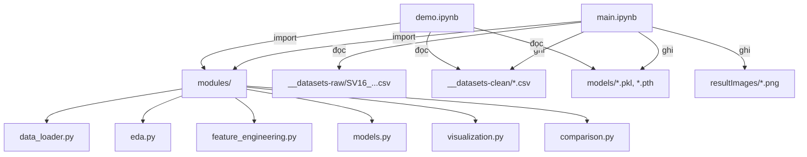
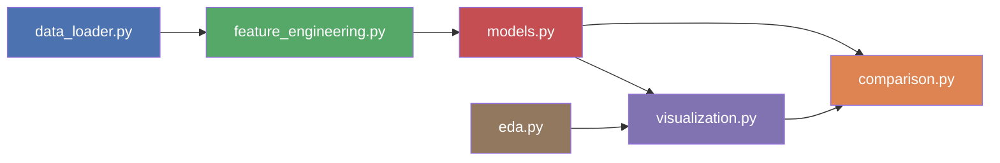

# Workflow chi tiết — Đồ án Học máy SV16

## Tổng quan kiến trúc



Toàn bộ logic xử lý nằm trong `modules/`. Notebook `main.ipynb` chỉ import và gọi hàm theo đúng 6 bước. Notebook `demo.ipynb` chạy sau, load kết quả đã lưu để hiển thị dashboard.

---

## Luồng thực thi trong `main.ipynb`

### Bước 1 → Cài đặt và nhập thư viện

```
Cell 1.1: !pip install -r requirements.txt     (chạy 1 lần)
Cell 1.2: import modules (data_loader, eda, fe, models, viz, comparison)
          %load_ext autoreload / %autoreload 2  (tự reload khi sửa code module)
```

**Mục đích**: Đảm bảo tất cả dependencies sẵn sàng và các module tự cập nhật khi chỉnh sửa.

---

### Bước 2 → Kiểm tra GPU

```python
torch.cuda.is_available()     # → True/False
torch.cuda.get_device_name(0) # → Tên GPU (nếu có)
```

**Mục đích**: Xác nhận CUDA cho LSTM. Nếu không có GPU, LSTM vẫn chạy được trên CPU (chậm hơn). Module `models.py` tự detect device.

---

### Bước 3 → Cấu hình (CONFIG)

Tất cả thông số của bài toán được khai báo trong **1 dict duy nhất** `CONFIG`:

```python
CONFIG = {
    'data_path':           '__datasets-raw/SV16_PeMSD3_sample_8sensors.csv',
    'baseline_a_sensors':  ['PEMSD3_007', ..., 'PEMSD3_010'],  # 4 sensors
    'baseline_b_sensors':  ['PEMSD3_011', ..., 'PEMSD3_014'],  # 4 sensors
    'train_ratio':         0.70,
    'valid_ratio':         0.15,
    'lag_steps':           [1, 2, 3],         # 3 bước lag
    'lag_columns':         ['flow', 'speed', 'occupancy'],
    'rolling_windows':     [3, 6, 12],        # 15min, 30min, 1h
    'rolling_columns':     ['flow', 'speed'],
    'target_horizon':      3,                 # dự báo 15 phút
    'random_state':        42,
    'model_params': { ... },                  # hyperparams cho 7 mô hình
}
```

**Mục đích**: Tập trung mọi tham số để dễ thay đổi mà không cần sửa code bên dưới.

---

### Bước 4 → Xử lý dữ liệu

#### 4.1 — Nhập dữ liệu

```
data_loader.load_raw_data(path)
         │
         ├── pd.read_csv(path)
         ├── parse timestamp → datetime
         └── sort theo (sensor_id, timestamp)
         
         → df_raw: 48,385 dòng × 6 cột
```

Cột gốc: `timestamp | sensor_id | flow | speed | occupancy | district`

#### 4.2 — Thống kê mô tả & EDA

```
eda.describe_per_sensor(df_raw)    → Bảng mean/std/min/max cho flow, speed, occupancy × 8 sensors
eda.check_missing(df_raw)          → Bảng missing values + timestamp gaps per sensor
eda.plot_timeseries_flow(df_raw)   → 8 biểu đồ dòng flow theo thời gian
eda.plot_distribution(df_raw)      → Boxplot so sánh flow/speed/occupancy giữa 8 sensors
eda.plot_correlation(df_raw)       → Heatmap correlation flow ↔ speed ↔ occupancy
eda.plot_hourly_pattern(df_raw)    → Flow trung bình theo giờ (weekday vs weekend)
```

Output: Các biểu đồ lưu vào `resultImages/`.

#### 4.3 — Feature Engineering

```
fe.prepare_all_features(df_raw, CONFIG)
         │
         ├── 1. add_time_features()
         │       df['hour']       = 0..23
         │       df['weekday']    = 0(Mon)..6(Sun)
         │       df['is_weekend'] = 0 hoặc 1
         │       df['time_slot']  = 0(đêm) 1(sáng) 2(trưa) 3(chiều) 4(tối)
         │
         ├── 2. add_lag_features(group by sensor_id)
         │       Với mỗi col ∈ [flow, speed, occupancy]:
         │         col_lag_1 = shift(1)    → giá trị tại t-5min
         │         col_lag_2 = shift(2)    → giá trị tại t-10min
         │         col_lag_3 = shift(3)    → giá trị tại t-15min
         │       ⚠️ BẮT BUỘC groupby('sensor_id') trước khi shift
         │       → Tạo 9 cột lag (3 cols × 3 lags)
         │
         ├── 3. add_rolling_features(group by sensor_id)
         │       Với mỗi col ∈ [flow, speed], window ∈ [3, 6, 12]:
         │         col_roll_mean_w = rolling(w).mean()
         │         col_roll_std_w  = rolling(w).std()
         │       → Tạo 12 cột rolling (2 cols × 3 windows × 2 stats)
         │
         ├── 4. add_target(horizon=3)
         │       df['flow_target'] = groupby('sensor_id')['flow'].shift(-3)
         │       → Đây là flow tại t+15min (3 bước × 5 phút)
         │
         └── 5. dropna()
                 Xóa các dòng NaN do lag/rolling/target shift
                 → df_featured: ~45K dòng × ~28 cột
```

**Tổng cộng features cho modeling (24 features):**

| Nhóm | Cột | Số lượng |
|---|---|---|
| Lag features | `flow_lag_1..3`, `speed_lag_1..3`, `occupancy_lag_1..3` | 9 |
| Rolling features | `flow_roll_mean_3/6/12`, `flow_roll_std_3/6/12`, `speed_roll_mean_3/6/12`, `speed_roll_std_3/6/12` | 12 |
| Time features | `hour`, `weekday`, `is_weekend` | 3 |
| **Tổng** | | **24** |
| **Target** | `flow_target` | 1 |

#### 4.4 — Chia Baseline A & B

```
data_loader.split_baselines(df_featured, sensors_a, sensors_b)
         │
         ├── df_baseline_a = df[sensor ∈ {007, 008, 009, 010}]  → ~22K dòng
         └── df_baseline_b = df[sensor ∈ {011, 012, 013, 014}]  → ~22K dòng
```

#### 4.5 — Hold-out Split (per sensor, theo thời gian)

```
fe.holdout_split(df_baseline_a, train=0.70, valid=0.15)
         │
         │   Với MỖI sensor_id trong baseline:
         │     1. Sort theo timestamp (đảm bảo thứ tự thời gian)
         │     2. Lấy 70% đầu   → Train  (Feb 01 → ~Feb 15)
         │     3. Lấy 15% giữa  → Valid  (~Feb 15 → ~Feb 18)
         │     4. Lấy 15% cuối  → Test   (~Feb 18 → Feb 21)
         │
         │   ⚠️ KHÔNG shuffle — tránh rò rỉ dữ liệu tương lai
         │
         ├── train_a, valid_a, test_a   (cho Baseline A)
         └── train_b, valid_b, test_b   (cho Baseline B)
```

**Sau đó tách X, y:**
```python
X_train_a = train_a[FEATURE_COLS].values   # numpy array (n, 24)
y_train_a = train_a['flow_target'].values  # numpy array (n,)
# tương tự cho valid, test, baseline B
```

**Lưu CSV:** 6 file vào `__datasets-clean/` (baselineA_train/valid/test, baselineB_train/valid/test).

---

### Bước 5 → Xây dựng mô hình Baseline

#### 5.1 & 5.2 — Huấn luyện 7 mô hình cho mỗi Baseline

```
models.get_models(CONFIG)
         │
         └── Tạo dict 7 mô hình:
               1_LinearRegression  → sklearn LinearRegression()
               2_Ridge             → sklearn Ridge(alpha=1.0)
               3_KNN               → sklearn KNeighborsRegressor(n=10, weights='distance')
               4_DecisionTree      → sklearn DecisionTreeRegressor(max_depth=15)
               5_RandomForest      → sklearn RandomForestRegressor(n=100, max_depth=15)
               6_XGBoost           → xgboost XGBRegressor(n=200, max_depth=8, lr=0.1)
               7_LSTM              → LSTMWrapper(hidden=64, layers=2, epochs=50)

models.train_and_evaluate(models, X_train, y_train, X_valid, y_valid, X_test, y_test)
         │
         │   Với MỖI mô hình:
         │     ┌──────────────────────────────────────────────┐
         │     │ Mô hình sklearn (1-6):                      │
         │     │   model.fit(X_train, y_train)                │
         │     │   → Sử dụng trực tiếp numpy arrays          │
         │     ├──────────────────────────────────────────────┤
         │     │ LSTM (7):                                    │
         │     │   1. StandardScaler.fit_transform(X_train)   │
         │     │   2. Reshape → (n, 1, 24) cho LSTM input     │
         │     │   3. Tạo DataLoader (batch_size=256)         │
         │     │   4. Train loop (max 50 epochs):             │
         │     │      - Forward pass qua LSTMNet              │
         │     │      - MSELoss + Adam optimizer              │
         │     │      - Check val_loss mỗi epoch              │
         │     │      - Early stopping (patience=8)           │
         │     │   5. Load best model state                   │
         │     └──────────────────────────────────────────────┘
         │
         │     → model.predict(X_test)
         │     → evaluate(y_test, y_pred) → {MAE, RMSE, MAPE, R²}
         │
         ├── results_df: DataFrame metrics (7 dòng × 8 cột metrics)
         └── trained_models: dict chứa {model, y_pred_test, metrics}
```

**LSTM Architecture (`LSTMNet`):**
```
Input (batch, 1, 24)
  → nn.LSTM(input=24, hidden=64, layers=2, dropout=0.2)
  → Lấy output timestep cuối [:, -1, :]  → (batch, 64)
  → nn.Linear(64, 32) → ReLU → Dropout(0.2)
  → nn.Linear(32, 1) → squeeze
Output (batch,)  →  flow dự báo
```

#### 5.3 — Lưu mô hình

```
models.save_models(trained_models, 'models/', 'Baseline_A')
         │
         ├── Sklearn models → joblib.dump() → models/Baseline_A/1_LinearRegression.pkl
         └── LSTM           → torch.save()  → models/Baseline_A/7_LSTM.pth
                               (lưu state_dict + scaler + config)
```

#### 5.4 & 5.5 — Biểu đồ Actual vs Predicted

```
viz.plot_all_model_results(trained_models, y_test, baseline_name)
         │
         └── Tạo 1 figure với 7 subplot (mỗi model 1 subplot):
               - Line xanh: Actual flow (300 điểm đầu)
               - Line cam: Predicted flow
               - Title hiển thị MAE, RMSE, R²
```

---

### Bước 6 → So sánh 2 Baseline

#### 6.1 — Bảng tổng hợp

```
comparison.create_comparison_table(results_a, results_b)
         │
         └── DataFrame ngang:
               model | A_MAE | A_RMSE | A_MAPE | A_R2 | B_MAE | B_RMSE | B_MAPE | B_R2 | better
               ──────┼───────┼────────┼────────┼──────┼───────┼────────┼────────┼──────┼──────
               1_LR  │ ...   │ ...    │ ...    │ ...  │ ...   │ ...    │ ...    │ ...  │ A/B
               ...   │       │        │        │      │       │        │        │      │
```

#### 6.2 — Biểu đồ so sánh

```
comparison.plot_comparison_all_metrics(results_a, results_b)
         │
         └── 4 grouped bar charts:
               - test_MAE:  Baseline A vs B cho 7 models
               - test_RMSE: Baseline A vs B cho 7 models
               - test_MAPE: Baseline A vs B cho 7 models
               - test_R2:   Baseline A vs B cho 7 models
```

#### 6.3 — Radar Chart

```
comparison.plot_comparison_radar(results_a, results_b)
         │
         └── Polar chart 7 cánh (1 per model):
               - Đường xanh = R² Baseline A
               - Đường cam  = R² Baseline B
```

#### 6.4 — Best model Actual vs Predicted

```
Tìm model có test_RMSE thấp nhất cho mỗi baseline
→ viz.plot_actual_vs_predicted() cho best A và best B
```

#### 6.5 — Nhận xét tự động

```
comparison.generate_conclusion(results_a, results_b)
         │
         ├── 🏆 Best model Baseline A: tên + metrics
         ├── 🏆 Best model Baseline B: tên + metrics
         ├── 📊 RMSE trung bình: A vs B → Baseline nào tốt hơn
         └── 📝 So sánh từng model: A vs B → winner + chênh lệch
```

---

## Luồng thực thi trong `demo.ipynb`

```
1. Load datasets đã xử lý từ __datasets-clean/
2. Load mô hình sklearn đã train từ models/Baseline_A/*.pkl, models/Baseline_B/*.pkl
3. Dashboard widgets:
   ┌─────────────────────────────────────────────────────────┐
   │  Section 3: Chọn sensor + metric → Biểu đồ dữ liệu gốc │
   │  - Dropdown: sensor_id (8 sensors)                       │
   │  - Dropdown: flow / speed / occupancy                    │
   │  → Plot time-series + thống kê nhanh                     │
   ├─────────────────────────────────────────────────────────┤
   │  Section 4: Chọn baseline + model → Actual vs Predicted  │
   │  - Dropdown: Baseline_A / Baseline_B                     │
   │  - Dropdown: 1_LinearRegression ... 6_XGBoost            │
   │  - Slider: số điểm hiển thị (50-1000)                    │
   │  → Plot + Metrics + Traffic Alert:                        │
   │    🟢 Bình thường (avg_flow ≤ 80)                        │
   │    🟡 Cần theo dõi (80 < avg_flow ≤ 120)                │
   │    🔴 Cảnh báo (avg_flow > 120)                          │
   ├─────────────────────────────────────────────────────────┤
   │  Section 5: So sánh song song A vs B                     │
   │  - Dropdown: chọn model                                  │
   │  → 2 subplot cạnh nhau: Baseline A | Baseline B          │
   └─────────────────────────────────────────────────────────┘
```

---

## Sơ đồ phụ thuộc giữa các modules



| Module | Input | Output | Gọi bởi |
|---|---|---|---|
| `data_loader` | CSV path | `df_raw`, `df_a`, `df_b` | main.ipynb §4.1, §4.4 |
| `eda` | `df_raw` | Biểu đồ + bảng thống kê | main.ipynb §4.2 |
| `feature_engineering` | `df_raw` + CONFIG | `df_featured`, train/valid/test splits | main.ipynb §4.3, §4.5 |
| `models` | X_train, y_train, ... | `results_df`, `trained_models` | main.ipynb §5 |
| `visualization` | y_test, y_pred | Biểu đồ | main.ipynb §5.4, §5.5 |
| `comparison` | results_a, results_b | Bảng + biểu đồ + kết luận | main.ipynb §6 |

---

## Dòng chảy dữ liệu end-to-end

```
SV16_PeMSD3_sample_8sensors.csv (48,385 dòng × 6 cột)
  │
  ├── [data_loader.load_raw_data]
  │     → df_raw (48,385 × 6)
  │
  ├── [eda.run_full_eda]
  │     → biểu đồ + thống kê (không biến đổi data)
  │
  ├── [fe.prepare_all_features]
  │     → df_featured (~45K × ~28 cột)
  │     ↓ thêm: 4 time + 9 lag + 12 rolling + 1 target, bỏ NaN
  │
  ├── [data_loader.split_baselines]
  │     → df_baseline_a (~22K dòng)
  │     → df_baseline_b (~22K dòng)
  │
  ├── [fe.holdout_split] × 2
  │     → Baseline A: train_a / valid_a / test_a
  │     → Baseline B: train_b / valid_b / test_b
  │     → Lưu 6 CSV vào __datasets-clean/
  │
  ├── [.values] tách X (24 features) và y (flow_target)
  │     → X_train_a, y_train_a, X_valid_a, ...
  │     → X_train_b, y_train_b, X_valid_b, ...
  │
  ├── [models.train_and_evaluate] × 2 baselines
  │     → 7 models × fit + predict + evaluate
  │     → results_a (DataFrame 7×8)
  │     → results_b (DataFrame 7×8)
  │     → trained_a, trained_b (dict models + predictions)
  │     → Lưu .pkl/.pth vào models/
  │
  └── [comparison.*]
        → Bảng so sánh + biểu đồ + kết luận tự động
        → Lưu biểu đồ vào resultImages/
```
