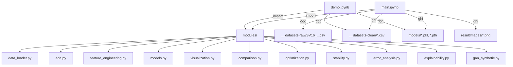
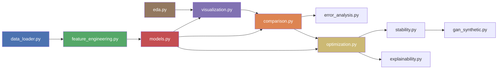

# Workflow chi tiết — Đồ án Học máy SV16

## Tổng quan kiến trúc



Toàn bộ logic xử lý nằm trong `modules/`. Notebook `main.ipynb` chỉ import và gọi hàm theo đúng các bước của pipeline. Notebook `demo.ipynb` chạy sau, load kết quả đã lưu để hiển thị dashboard.

---

## Luồng thực thi trong `main.ipynb`

### Bước 1 → Cài đặt và nhập thư viện

```
Cell 1.1: !pip install -r requirements.txt     (chạy 1 lần)
Cell 1.2: import modules (data_loader, eda, fe, models, viz, comparison)
          %load_ext autoreload / %autoreload 2  (tự reload khi sửa code module)
```

**Mục đích**: Đảm bảo tất cả dependencies sẵn sàng và các module tự cập nhật khi chỉnh sửa.

---

### Bước 2 → Kiểm tra GPU

```python
torch.cuda.is_available()     # → True/False
torch.cuda.get_device_name(0) # → Tên GPU (nếu có)
```

**Mục đích**: Xác nhận CUDA cho LSTM. Nếu không có GPU, LSTM vẫn chạy được trên CPU (chậm hơn). Module `models.py` tự detect device.

---

### Bước 3 → Cấu hình (CONFIG)

Tất cả thông số của bài toán được khai báo trong **1 dict duy nhất** `CONFIG`:

```python
CONFIG = {
    'data_path':           '__datasets-raw/SV16_PeMSD3_sample_8sensors.csv',
    'baseline_a_sensors':  ['PEMSD3_007', ..., 'PEMSD3_010'],  # 4 sensors
    'baseline_b_sensors':  ['PEMSD3_011', ..., 'PEMSD3_014'],  # 4 sensors
    'train_ratio':         0.70,
    'valid_ratio':         0.15,
    'lag_steps':           [1, 2, 3, 6, 12],  # 5 bước lag
    'lag_columns':         ['flow', 'speed', 'occupancy'],
    'rolling_windows':     [3, 6, 12],        # 15min, 30min, 1h
    'rolling_columns':     ['flow', 'speed', 'occupancy'],
    'target_horizon':      3,                 # dự báo 15 phút
    'random_state':        42,
    'model_params': { ... },                  # hyperparams cho 10 mô hình
}
```

**Mục đích**: Tập trung mọi tham số để dễ thay đổi mà không cần sửa code bên dưới.

---

### Bước 4 → Xử lý dữ liệu

#### 4.1 — Nhập dữ liệu

```
data_loader.load_raw_data(path)
         │
         ├── pd.read_csv(path)
         ├── parse timestamp → datetime
         └── sort theo (sensor_id, timestamp)
         
         → df_raw: 48,385 dòng × 6 cột
```

Cột gốc: `timestamp | sensor_id | flow | speed | occupancy | district`

#### 4.2 — Thống kê mô tả & EDA

```
eda.describe_per_sensor(df_raw)    → Bảng mean/std/min/max cho flow, speed, occupancy × 8 sensors
eda.check_missing(df_raw)          → Bảng missing values + timestamp gaps per sensor
eda.plot_timeseries_flow(df_raw)   → 8 biểu đồ dòng flow theo thời gian
eda.plot_distribution(df_raw)      → Boxplot so sánh flow/speed/occupancy giữa 8 sensors
eda.plot_correlation(df_raw)       → Heatmap correlation flow ↔ speed ↔ occupancy
eda.plot_hourly_pattern(df_raw)    → Flow trung bình theo giờ (weekday vs weekend)
```

Output: Các biểu đồ lưu vào `resultImages/`.

#### 4.3 — Feature Engineering

```
fe.prepare_all_features(df_raw, CONFIG)
         │
         ├── 1. add_time_features()
         │       df['hour']       = 0..23
         │       df['weekday']    = 0(Mon)..6(Sun)
         │       df['is_weekend'] = 0 hoặc 1
         │       df['time_slot']  = 0(đêm) 1(sáng) 2(trưa) 3(chiều) 4(tối)
         │
         ├── 2. add_lag_features(group by sensor_id)
         │       Với mỗi col ∈ [flow, speed, occupancy]:
         │         col_lag_1  = shift(1)    → giá trị tại t-5min
         │         col_lag_2  = shift(2)    → giá trị tại t-10min
         │         col_lag_3  = shift(3)    → giá trị tại t-15min
         │         col_lag_6  = shift(6)    → giá trị tại t-30min
         │         col_lag_12 = shift(12)   → giá trị tại t-1h
         │       ⚠️ BẮT BUỘC groupby('sensor_id') trước khi shift
         │       → Tạo 15 cột lag (3 cols × 5 lags)
         │
         ├── 3. add_rolling_features(group by sensor_id)
         │       Với mỗi col ∈ [flow, speed, occupancy], window ∈ [3, 6, 12]:
         │         col_roll_mean_w = rolling(w).mean()
         │         col_roll_std_w  = rolling(w).std()
         │       → Tạo 18 cột rolling (3 cols × 3 windows × 2 stats)
         │
         ├── 4. add_target(horizon=3)
         │       df['flow_target'] = groupby('sensor_id')['flow'].shift(-3)
         │       → Đây là flow tại t+15min (3 bước × 5 phút)
         │
         └── 5. dropna()
                 Xóa các dòng NaN do lag/rolling/target shift
                 → df_featured: ~44K dòng × ~40 cột
```

**Tổng cộng features cho modeling (36 features):**

| Nhóm | Cột | Số lượng |
|---|---|---|
| Lag features | `flow_lag_1..12`, `speed_lag_1..12`, `occupancy_lag_1..12` | 15 |
| Rolling features | `flow_roll_mean/std_3/6/12`, `speed_roll_mean/std_3/6/12`, `occupancy_roll_mean/std_3/6/12` | 18 |
| Time features | `hour`, `weekday`, `is_weekend` | 3 |
| **Tổng** | | **36** |
| **Target** | `flow_target` | 1 |

#### 4.4 — Chia Baseline A & B

```
data_loader.split_baselines(df_featured, sensors_a, sensors_b)
         │
         ├── df_baseline_a = df[sensor ∈ {007, 008, 009, 010}]  → ~22K dòng
         └── df_baseline_b = df[sensor ∈ {011, 012, 013, 014}]  → ~22K dòng
```

#### 4.5 — Hold-out Split (per sensor, theo thời gian)

```
fe.holdout_split(df_baseline_a, train=0.70, valid=0.15)
         │
         │   Với MỖI sensor_id trong baseline:
         │     1. Sort theo timestamp (đảm bảo thứ tự thời gian)
         │     2. Lấy 70% đầu   → Train  (Feb 01 → ~Feb 15)
         │     3. Lấy 15% giữa  → Valid  (~Feb 15 → ~Feb 18)
         │     4. Lấy 15% cuối  → Test   (~Feb 18 → Feb 21)
         │
         │   ⚠️ KHÔNG shuffle — tránh rò rỉ dữ liệu tương lai
         │
         ├── train_a, valid_a, test_a   (cho Baseline A)
         └── train_b, valid_b, test_b   (cho Baseline B)
```

**Sau đó tách X, y:**
```python
X_train_a = train_a[FEATURE_COLS].values   # numpy array (n, 36)
y_train_a = train_a['flow_target'].values  # numpy array (n,)
# tương tự cho valid, test, baseline B
```

**Lưu CSV:** 6 file vào `__datasets-clean/` (baselineA_train/valid/test, baselineB_train/valid/test).

---

### Bước 5 → Xây dựng mô hình Baseline

#### 5.1 & 5.2 — Huấn luyện 10 mô hình cho mỗi Baseline

```
models.get_models(CONFIG)
         │
         └── Tạo dict 10 mô hình:
               ── Trivial Baselines ──
               0a_SeasonalNaive    → SeasonalNaive()   (dùng flow_lag_12)
               0b_DriftMethod      → DriftMethod()     (flow_lag_1 + trend)
               0c_SMA              → SimpleMovingAverage() (flow_roll_mean_12)
               ── ML Models ──
               1_LinearRegression  → sklearn LinearRegression()
               2_Ridge             → sklearn Ridge(alpha=1.0)
               3_KNN               → sklearn KNeighborsRegressor(n=10, weights='distance')
               4_DecisionTree      → sklearn DecisionTreeRegressor(max_depth=15)
               5_RandomForest      → sklearn RandomForestRegressor(n=100, max_depth=15)
               6_XGBoost           → xgboost XGBRegressor(n=200, max_depth=8, lr=0.1)
               7_LSTM              → LSTMWrapper(hidden=64, layers=2, epochs=50)

models.train_and_evaluate(models, X_train, y_train, X_valid, y_valid, X_test, y_test)
         │
         │   Với MỖI mô hình:
         │     ┌──────────────────────────────────────────────┐
         │     │ Trivial baselines (0a-0c):                   │
         │     │   model.fit(X_train, y_train)                │
         │     │   → Chỉ lưu thông số đơn giản (mean, index) │
         │     ├──────────────────────────────────────────────┤
         │     │ Mô hình sklearn (1-6):                      │
         │     │   model.fit(X_train, y_train)                │
         │     │   → Sử dụng trực tiếp numpy arrays          │
         │     ├──────────────────────────────────────────────┤
         │     │ LSTM (7):                                    │
         │     │   1. StandardScaler.fit_transform(X_train)   │
         │     │   2. Reshape → (n, 1, 36) cho LSTM input     │
         │     │   3. Tạo DataLoader (batch_size=256)         │
         │     │   4. Train loop (max 50 epochs):             │
         │     │      - Forward pass qua LSTMNet              │
         │     │      - MSELoss + Adam optimizer              │
         │     │      - Check val_loss mỗi epoch              │
         │     │      - Early stopping (patience=8)           │
         │     │   5. Load best model state                   │
         │     └──────────────────────────────────────────────┘
         │
         │     → model.predict(X_test)
         │     → evaluate(y_test, y_pred, y_train) → {MAE, RMSE, MAPE, R², MASE}
         │
         ├── results_df: DataFrame metrics (10 dòng × train/valid/test × 5 metrics)
         │   ⭐ Sắp xếp theo test_RMSE tăng dần (tốt nhất ở trên)
         └── trained_models: dict chứa {model, y_pred_train/valid/test, metrics, train_time}
```

**LSTM Architecture (`LSTMNet`):**
```
Input (batch, 1, 36)
  → nn.LSTM(input=36, hidden=64, layers=2, dropout=0.2)
  → Lấy output timestep cuối [:, -1, :]  → (batch, 64)
  → nn.Linear(64, 32) → ReLU → Dropout(0.2)
  → nn.Linear(32, 1) → squeeze
Output (batch,)  →  flow dự báo
```

#### 5.3 — Lưu mô hình

```
models.save_models(trained_models, 'models/', 'Baseline_A')
         │
         ├── Sklearn models → joblib.dump() → models/Baseline_A/1_LinearRegression.pkl
         └── LSTM           → torch.save()  → models/Baseline_A/7_LSTM.pth
                               (lưu state_dict + scaler + config)
```

#### 5.4 & 5.5 — Biểu đồ Actual vs Predicted

```
viz.plot_all_model_results(trained_models, y_test, baseline_name)
         │
         └── Tạo 1 figure với 10 subplot (mỗi model 1 subplot):
               - Line xanh: Actual flow (300 điểm đầu)
               - Line cam: Predicted flow
               - Title hiển thị MAE, RMSE, R²
```

---

### Bước 6 → So sánh 2 Baseline

#### 6.1 — Bảng tổng hợp

```
comparison.create_comparison_table(results_a, results_b)
         │
         └── DataFrame ngang:
               model | A_MAE | A_RMSE | A_MAPE | A_R2 | A_MASE | B_MAE | B_RMSE | B_MAPE | B_R2 | B_MASE | better
               ──────┼───────┼────────┼────────┼──────┼───────┼───────┼────────┼────────┼──────┼───────┼──────
               0a_SN │ ...   │ ...    │ ...    │ ...  │ ...   │ ...   │ ...    │ ...    │ ...  │ ...   │ A/B
               ...   │       │        │        │      │       │       │        │        │      │       │
               ⭐ 'better' dựa trên RMSE (thấp hơn = tốt hơn)
```

#### 6.2 — Biểu đồ so sánh

```
comparison.plot_comparison_all_metrics(results_a, results_b)
         │
         └── 5 grouped bar charts:
               - test_MAE:  Baseline A vs B cho 10 models
               - test_RMSE: Baseline A vs B cho 10 models (tiêu chí chính)
               - test_MAPE: Baseline A vs B cho 10 models
               - test_R2:   Baseline A vs B cho 10 models
               - test_MASE: Baseline A vs B cho 10 models
```

#### 6.3 — Radar Chart

```
comparison.plot_comparison_radar(results_a, results_b)
         │
         └── Polar chart 10 cánh (1 per model):
               - Đường xanh = R² Baseline A
               - Đường cam  = R² Baseline B
```

#### 6.4 — Best model Actual vs Predicted

```
Tìm model có test_RMSE thấp nhất cho mỗi baseline
→ viz.plot_actual_vs_predicted() cho best A và best B
```

#### 6.5 — Nhận xét tự động

```
comparison.generate_conclusion(results_a, results_b)
         │
         ├── 🏆 Best model Baseline A: tên + metrics
         ├── 🏆 Best model Baseline B: tên + metrics
         ├── 📊 RMSE trung bình: A vs B → Baseline nào tốt hơn
         └── 📝 So sánh từng model: A vs B → winner + chênh lệch
```

#### 6.6 — Phân tích lỗi dự báo

```
error_analysis.build_error_dataframe()
         │
         ├── Ghép test_df + actual + predicted + residual
         ├── Tính error, abs_error, APE, bias_type
         ├── Gắn flow_regime: low / medium / high
         └── Lưu chi tiết lỗi để đưa vào báo cáo

error_analysis.summarize_error_segments()
         │
         ├── Tổng hợp lỗi theo sensor_id
         ├── Tổng hợp lỗi theo hour
         └── Tổng hợp lỗi theo flow_regime

error_analysis.infer_error_causes()
         │
         └── Gợi ý nguyên nhân có thể và hướng cải thiện
```

Phần này nằm trước Pymoo vì yêu cầu nhiệm vụ cần nêu các trường hợp dự báo sai trước khi chuyển sang tối ưu hyperparameter. Các bảng chính gồm `worst_forecasts`, `sensor_error_summary`, `hour_error_summary`, `flow_regime_error_summary` và `error_cause_table`.

---

### Bước 7 → Tối ưu hóa đa mục tiêu (Pymoo)

#### 7.1 — Chọn 2 mô hình tốt nhất

```
optimization.select_best_models(results_a, results_b, top_n=2)
         │
         ├── Lọc bỏ trivial baselines (0a, 0b, 0c)
         ├── Tính avg_RMSE = (A_RMSE + B_RMSE) / 2 cho mỗi mô hình
         └── Chọn top 2 có avg_RMSE thấp nhất
```

#### 7.2 — Thiết lập bài toán Pymoo

```
3 Mục tiêu (Tất cả MINIMIZE):
   f1 = RMSE (valid set)        → Chất lượng dự báo
   f2 = Train time (giây)       → Thời gian huấn luyện
   f3 = Model complexity        → Độ phức tạp (ví dụ: n_trees × depth)

Thuật toán: NSGA-II (hoặc NSGA-III)
   - Quần thể: 200–400
   - Thế hệ: 100–200
   - Crossover: SBX (prob=0.9, eta=15)
   - Mutation: PM (eta=20)
```

#### 7.3 & 7.4 — Chạy tối ưu hóa cho Baseline A & B

```
optimization.run_optimization(model_name, X_train, y_train, X_valid, y_valid, baseline_tag=...)
         │
         ├── 1. Khởi tạo/Resume: pymooCheckpoint/optim_checkpoint_{baseline_tag}_{model_name}.pkl
         │       - Đọc checkpoint của baseline cụ thể (ví dụ: tag 'A' hoặc 'B')
         │       - Nếu đã hoàn thành >= n_gen: Bỏ qua huấn luyện, load và trả về kết quả ngay.
         │       - Nếu chưa hoàn thành: Tiến hành RESUME tiếp tục tiến hóa từ thế hệ gần nhất.
         │
         ├── 2. Tạo HyperparamOptProblem (Pymoo Problem)
         │       - Biến quyết định: hyperparameters liên tục
         │       - _evaluate(): fit model → đo RMSE + time + complexity
         │
         ├── 3. CheckpointCallback: Lưu tiến trình tiến hóa theo chu kỳ (mặc định mỗi thế hệ)
         │       - Ghi lại trạng thái quần thể và thời gian chạy vào file checkpoint tương ứng.
         │
         ├── 4. pymoo_minimize(problem, algorithm, n_gen)
         │       - Tiến hóa quần thể qua các thế hệ
         │       - Hội tụ về Pareto front
         │
         └── Kết quả:
               - result.F: Mảng (n_pareto, 3) giá trị 3 mục tiêu
               - result.X: Mảng (n_pareto, n_vars) biến quyết định
               - pareto_df: DataFrame sắp xếp theo RMSE
```

#### 7.5 — Trực quan hóa Pareto Front

```
optimization.plot_pareto_front_3d()   → Scatter 3D: RMSE × Time × Complexity
optimization.plot_pareto_2d_pairs()   → 3 scatter plots 2D:
         - RMSE vs Time
         - RMSE vs Complexity
         - Time vs Complexity
```

#### 7.6 — Phân tích đánh đổi

```
optimization.analyze_tradeoffs(pareto_df, model_name)
         │
         ├── 🎯 Nghiệm tốt nhất theo RMSE
         ├── ⚡ Nghiệm nhanh nhất
         ├── 🧩 Nghiệm đơn giản nhất
         ├── 📈 Phạm vi đánh đổi (trade-off range)
         │       Ví dụ: "Giảm 1 đơn vị RMSE cần ~X giây thêm"
         └── 🔑 Nghiệm cân bằng (TOPSIS-like compromise)
               → Params được đề xuất
```

#### Sau 9.4 — SHAP giải thích độ nhạy cho 4 mô hình tối ưu

```
explainability.fit_optimized_model()
         │
         └── Fit lại nghiệm cân bằng Pymoo trên train+valid

explainability.compute_shap_values()
         │
         ├── SHAP summary top 14 feature mạnh nhất
         ├── Gộp các feature còn lại thành "other"
         └── Bảng optimized_shap_top14_other.csv
```

Trong pipeline hiện tại, XAI đặt sau Pymoo, Monte Carlo và trượt thời gian để giải thích đúng 4 mô hình tối ưu đã được kiểm định. Notebook chỉ dùng SHAP.

---

### Bước 8 → Chứng minh độ ổn định bằng Monte Carlo

```
stability.params_from_solution(model_name, best_solution)
         │
         └── Trích params từ nghiệm cân bằng của Pareto front

stability.run_monte_carlo(model_name, params, X_train, y_train, X_test, y_test,
                          X_valid=X_valid, y_valid=y_valid, seeds=...)
         │
         ├── Giữ nguyên split train/valid/test theo thời gian
         ├── Fit lại model trên train+valid vì hyperparameters đã được chọn
         ├── Chỉ thay đổi random_state của thuật toán/model qua mỗi run
         ├── Dự đoán trên test cố định
         └── Ghi lại MAE, RMSE, MAPE, R², MASE, train_time
```

Notebook chạy cho 4 trường hợp sau tối ưu: 2 mô hình tốt nhất × Baseline A/B.

Trực quan hóa:

```
stability.plot_monte_carlo_boxplot()  → Boxplot RMSE qua các random_state
stability.plot_monte_carlo_kde()      → Histogram + KDE
stability.plot_monte_carlo_ci()       → Mean RMSE + khoảng tin cậy 95%
```

Giải thích quan trọng: Monte Carlo không được đổi random_state của bước chia dữ liệu vì time series phải giữ thứ tự thời gian. Random split có thể đưa dữ liệu tương lai vào train và làm sai lệch đánh giá. Monte Carlo ở đây đo độ nhạy của thuật toán sau tối ưu, không đo độ ngẫu nhiên của split.

---

### Bước 9 → Chứng minh độ ổn định bằng kỹ thuật trượt thời gian

```
stability.create_time_sliding_folds(df, train_ratio=0.60,
                                    test_ratio=0.10,
                                    step_ratio=0.05,
                                    n_folds=5)
         │
         ├── Fold 1: Train 0-60%,  Test 60-70%
         ├── Fold 2: Train 5-65%,  Test 65-75%
         ├── Fold 3: Train 10-70%, Test 70-80%
         ├── Fold 4: Train 15-75%, Test 75-85%
         └── Fold 5: Train 20-80%, Test 80-90%

stability.run_time_sliding_validation()
         │
         ├── Tạo fold per sensor, luôn sort theo timestamp
         ├── Huấn luyện model với params tối ưu trên từng train window
         ├── Đánh giá trên test window ngay phía sau
         └── Trả về RMSE/MAE/MAPE/R²/MASE theo fold
```

Kết luận ổn định:

```
stability.summarize_time_sliding()
         │
         ├── Tính RMSE mean/std/min/max/range
         ├── Tính RMSE_cv_% = std / mean × 100
         └── stable_by_cv=True nếu CV <= stable_cv_threshold (mặc định 10%)
```

Nếu đường `time_sliding_rmse.png` gần nằm ngang và `RMSE_cv_%` thấp, bộ dữ liệu được xem là ổn định theo thời gian đối với bài toán dự báo flow. Nếu có fold tăng RMSE đột biến, cần kiểm tra giai đoạn thời gian đó vì có thể xuất hiện biến động giao thông bất thường hoặc lỗi cảm biến.

---

### Bước 9.4 → Kết luận mô hình tốt nhất sau Pymoo và stability

```
stability.build_final_model_scorecard()
         │
         ├── Ghép nghiệm cân bằng của Pymoo
         ├── Ghép kết quả Monte Carlo trên test cố định
         ├── Ghép kết quả trượt thời gian qua 5 fold
         ├── Chuẩn hóa các tiêu chí theo hướng càng thấp càng tốt
         └── Tính final_score để xếp hạng 4 trường hợp tối ưu
```

Tiêu chí so sánh chính gồm `mc_RMSE_mean`, `mc_RMSE_cv_%`, `sliding_RMSE_mean`, `sliding_RMSE_cv_%`, `pareto_valid_RMSE`, `pareto_train_time_s` và `pareto_complexity`. Mô hình cuối cùng là mô hình có `final_score` thấp nhất, đồng thời đạt ngưỡng ổn định CV.

---

### Bước 10 → Tạo sinh dữ liệu bằng GAN

```
gan_synthetic.train_feature_gan()
         │
         ├── Học phân phối FEATURE_COLS + flow_target trên train set thật
         ├── Sinh synthetic samples tỷ lệ 1:1 hoặc 1:N
         ├── Đánh giá Train Real/Test Fake và Train Fake/Test Real
         └── Thử 100% real + 50/100/200% synthetic để tìm điểm bão hòa
```

GAN được áp dụng trong không gian mẫu đã có lag/rolling/time features, không concat trực tiếp timeline giả vào chuỗi thật. Nếu dữ liệu ảo giúp giảm RMSE trên real test, bước tiếp theo là chạy lại Pymoo trên tập train đã tăng cường và phân tích XAI/feature importance.

---

## Luồng thực thi trong `demo.ipynb`

```
1. Load datasets đã xử lý từ __datasets-clean/
2. Load mô hình sklearn đã train từ models/Baseline_A/*.pkl, models/Baseline_B/*.pkl
3. Dashboard widgets:
   ┌─────────────────────────────────────────────────────────┐
   │  Section 3: Chọn sensor + metric → Biểu đồ dữ liệu gốc │
   │  - Dropdown: sensor_id (8 sensors)                       │
   │  - Dropdown: flow / speed / occupancy                    │
   │  → Plot time-series + thống kê nhanh                     │
   ├─────────────────────────────────────────────────────────┤
   │  Section 4: Chọn baseline + model → Actual vs Predicted  │
   │  - Dropdown: Baseline_A / Baseline_B                     │
   │  - Dropdown: 1_LinearRegression ... 6_XGBoost            │
   │  - Slider: số điểm hiển thị (50-1000)                    │
   │  → Plot + Metrics + Traffic Alert:                        │
   │    🟢 Bình thường (avg_flow ≤ 80)                        │
   │    🟡 Cần theo dõi (80 < avg_flow ≤ 120)                │
   │    🔴 Cảnh báo (avg_flow > 120)                          │
   ├─────────────────────────────────────────────────────────┤
   │  Section 5: So sánh song song A vs B                     │
   │  - Dropdown: chọn model                                  │
   │  → 2 subplot cạnh nhau: Baseline A | Baseline B          │
   └─────────────────────────────────────────────────────────┘
```

---

## Sơ đồ phụ thuộc giữa các modules



| Module | Input | Output | Gọi bởi |
|---|---|---|---|
| `data_loader` | CSV path | `df_raw`, `df_a`, `df_b` | main.ipynb §4.1, §4.4 |
| `eda` | `df_raw` | Biểu đồ + bảng thống kê | main.ipynb §4.2 |
| `feature_engineering` | `df_raw` + CONFIG | `df_featured`, train/valid/test splits | main.ipynb §4.3, §4.5 |
| `models` | X_train, y_train, ... | `results_df`, `trained_models` | main.ipynb §5 |
| `visualization` | y_test, y_pred | Biểu đồ | main.ipynb §5.4, §5.5 |
| `comparison` | results_a, results_b | Bảng + biểu đồ + kết luận | main.ipynb §6 |
| `error_analysis` | test_df, actual, predicted | Worst cases, lỗi theo sensor/hour/flow, nguyên nhân và hướng cải thiện | main.ipynb §6.6 |
| `optimization` | X_train/valid, results_a/b | Pareto front + trade-off analysis | main.ipynb §7 |
| `explainability` | optimized params, train/valid/test, FEATURE_COLS | SHAP top 14 + other cho 4 mô hình tối ưu và mô hình sau GAN | main.ipynb §10, §11.4 |
| `stability` | Pareto params, train/valid/test, df baseline | Monte Carlo summary, time sliding summary, scorecard chọn mô hình cuối | main.ipynb §8, §9 |
| `gan_synthetic` | df train đã feature engineering, FEATURE_COLS, params 4 mô hình tối ưu | synthetic data, Real/Fake utility, augmentation results | main.ipynb §11 |

---

## Dòng chảy dữ liệu end-to-end

```
SV16_PeMSD3_sample_8sensors.csv (48,385 dòng × 6 cột)
  │
  ├── [data_loader.load_raw_data]
  │     → df_raw (48,385 × 6)
  │
  ├── [eda.run_full_eda]
  │     → biểu đồ + thống kê (không biến đổi data)
  │
  ├── [fe.prepare_all_features]
  │     → df_featured (~45K dòng, gồm dữ liệu gốc + features + target)
  │     ↓ thêm: 4 time + 15 lag + 18 rolling + 1 target, bỏ NaN
  │
  ├── [data_loader.split_baselines]
  │     → df_baseline_a (~22K dòng)
  │     → df_baseline_b (~22K dòng)
  │
  ├── [fe.holdout_split] × 2
  │     → Baseline A: train_a / valid_a / test_a
  │     → Baseline B: train_b / valid_b / test_b
  │     → Lưu 6 CSV vào __datasets-clean/
  │
  ├── [.values] tách X (36 features) và y (flow_target)
  │     → X_train_a, y_train_a, X_valid_a, ...
  │     → X_train_b, y_train_b, X_valid_b, ...
  │
  ├── [models.train_and_evaluate] × 2 baselines
  │     → 10 models × fit + predict(train/valid/test) + evaluate(5 metrics)
  │     → results_a (DataFrame 10 rows, sắp xếp theo test_RMSE)
  │     → results_b (DataFrame 10 rows)
  │     → trained_a, trained_b (dict models + predictions + train_time)
  │     → Lưu .pkl/.pth vào models/
  │
  ├── [comparison.*]
  │     → Bảng so sánh + biểu đồ + kết luận tự động
  │     → Lưu biểu đồ vào resultImages/
  │
  ├── [error_analysis.*]
  │     → Tạo bảng residual cho best model của mỗi baseline
  │     → Liệt kê worst forecast cases
  │     → Tổng hợp lỗi theo sensor/hour/flow regime
  │     → Gợi ý nguyên nhân có thể và hướng cải thiện
  │
  ├── [optimization.*]
  │     → Chọn 2 mô hình tốt nhất trên cả 2 baselines
  │     → NSGA-II/III → Pareto front (RMSE × Time × Complexity)
  │     → Trực quan hóa 3D + 2D + phân tích đánh đổi
  │
  ├── [stability.*]
  │     → Lấy params từ nghiệm cân bằng sau Pymoo
  │     → Monte Carlo cho 4 mô hình tối ưu, giữ split thời gian cố định
  │     → Vẽ boxplot, KDE, CI 95%
  │     → Time sliding 5 fold: train 60%, test 10%, shift 5%
  │     → Kết luận độ ổn định dữ liệu qua RMSE/CV
  │     → Scorecard cuối để chọn mô hình tốt nhất và ổn định nhất

  ├── [explainability.*]
  │     → Fit lại 4 nghiệm cân bằng Pymoo trên train+valid
  │     → SHAP summary top 14 + other
  │     → Lưu optimized_shap_top14_other.csv
  │
  └── [gan_synthetic.*]
        → Huấn luyện feature-space GAN trên train set thật
        → Sinh synthetic data đủ cho tỷ lệ lớn nhất 2.0
        → Đánh giá Train Real/Test Fake và Train Fake/Test Real cho 4 case
        → Thử tăng cường dữ liệu với tỷ lệ 0.0, 0.5, 1.0, 2.0
        → Tính SHAP sau GAN và so sánh với mô hình tối ưu gốc
```
