# TRƯỜNG ĐẠI HỌC CÔNG NGHỆ GIAO THÔNG VẬN TẢI

## KHOA CÔNG TRÌNH

# BÁO CÁO

## HỌC PHẦN: HỌC MÁY NÂNG CAO

# ĐỀ TÀI

## DỰ BÁO LƯU LƯỢNG GIAO THÔNG TRÊN DỮ LIỆU PeMSD3 BẰNG HỌC MÁY

Lớp: 74DCTG21

Giảng viên hướng dẫn: Hoàng Thị Hương Giang

Sinh viên thực hiện: SV16

Hà Nội - 2026

\newpage

# MỤC LỤC

| Mục | Nội dung |
| --- | --- |
| Mở đầu | Tính cấp thiết, mục tiêu, phương pháp, đối tượng, phạm vi và nội dung nghiên cứu |
| Chương 1 | Tổng quan vấn đề nghiên cứu |
| Chương 2 | Nghiên cứu lý thuyết và xây dựng cơ sở dữ liệu cho bài toán |
| Chương 3 | Ước tính lưu lượng giao thông dựa trên các mô hình học máy |
| Kết luận và kiến nghị | Tổng kết kết quả đạt được, hạn chế và hướng phát triển |
| Tài liệu tham khảo | Các tài liệu, thuật toán và thư viện được sử dụng |

\newpage

# DANH MỤC CÁC KÝ HIỆU, CHỮ VIẾT TẮT

| Ký hiệu | Diễn giải |
| --- | --- |
| AI | Artificial Intelligence - Trí tuệ nhân tạo |
| ML | Machine Learning - Học máy |
| PeMS | Performance Measurement System, hệ thống dữ liệu giao thông của California |
| RF | Random Forest |
| XGB | Extreme Gradient Boosting |
| KNN | K-Nearest Neighbors |
| LSTM | Long Short-Term Memory |
| GAN | Generative Adversarial Network |
| XAI | Explainable Artificial Intelligence |
| SHAP | SHapley Additive exPlanations |
| Pymoo | Thư viện tối ưu hóa đa mục tiêu trong Python |
| NSGA-II | Non-dominated Sorting Genetic Algorithm II |
| MAE | Mean Absolute Error |
| RMSE | Root Mean Squared Error |
| MAPE | Mean Absolute Percentage Error |
| MASE | Mean Absolute Scaled Error |
| R2 | Hệ số xác định |

\newpage

# DANH MỤC BẢNG SỐ LIỆU

| Bảng | Tên bảng |
| --- | --- |
| Bảng 2.1 | Thống kê tổng quan bộ dữ liệu PeMSD3 |
| Bảng 2.2 | Thống kê theo từng cảm biến |
| Bảng 2.3 | Nhóm đặc trưng sử dụng cho mô hình |
| Bảng 2.4 | Các chỉ tiêu đánh giá mô hình |
| Bảng 3.1 | Kết quả so sánh 10 mô hình trên hai baseline |
| Bảng 3.2 | Kết quả tối ưu và kiểm định ổn định của 4 mô hình sau Pymoo |
| Bảng 3.3 | Phân tích lỗi theo chế độ lưu lượng |
| Bảng 3.4 | Kết quả tăng cường dữ liệu bằng GAN |
| Bảng 3.5 | Top đặc trưng SHAP của mô hình cuối |

\newpage

# DANH MỤC HÌNH VẼ

| Hình | Tên hình |
| --- | --- |
| Hình 2.1 | Chuỗi thời gian lưu lượng giao thông |
| Hình 2.2 | Phân phối dữ liệu giao thông |
| Hình 2.3 | Ma trận tương quan sau feature engineering |
| Hình 2.4 | Quy luật lưu lượng theo giờ |
| Hình 3.1 | So sánh RMSE test giữa hai baseline |
| Hình 3.2 | Radar R2 giữa hai baseline |
| Hình 3.3 | Actual và Predicted của mô hình tốt nhất Baseline A |
| Hình 3.4 | Actual và Predicted của mô hình tốt nhất Baseline B |
| Hình 3.5 | Phân tích lỗi theo giờ |
| Hình 3.6 | Pareto front 3D của XGBoost trên Baseline B |
| Hình 3.7 | Pareto front 2D của XGBoost trên Baseline B |
| Hình 3.8 | Boxplot RMSE Monte Carlo |
| Hình 3.9 | Khoảng tin cậy 95% của RMSE Monte Carlo |
| Hình 3.10 | RMSE qua các cửa sổ trượt thời gian |
| Hình 3.11 | Phân tích điểm bão hòa dữ liệu GAN |
| Hình 3.12 | SHAP summary của mô hình cuối |

\newpage

# MỞ ĐẦU

## 1. Tính cấp thiết của đề tài

Giao thông đô thị là một hệ thống có tính biến động cao, chịu ảnh hưởng đồng thời bởi nhu cầu di chuyển, giờ cao điểm, đặc điểm tuyến đường, tốc độ phương tiện và mật độ sử dụng mặt đường. Khi lưu lượng xe tăng nhanh trong một khoảng thời gian ngắn, cơ quan quản lý giao thông cần có dự báo đủ sớm để điều chỉnh đèn tín hiệu, khuyến nghị phân luồng hoặc phát hiện bất thường tại các vị trí quan trắc. Vì vậy, dự báo lưu lượng giao thông ngắn hạn là một bài toán quan trọng trong giao thông thông minh và quản lý vận tải hiện đại.

Trong đề tài này, dữ liệu được sử dụng là mẫu PeMSD3 gồm 8 cảm biến giao thông, mỗi cảm biến ghi nhận dữ liệu theo chu kỳ 5 phút. Bài toán không chỉ dừng ở việc huấn luyện một mô hình dự báo, mà còn so sánh hai cụm cảm biến, kiểm tra độ ổn định của mô hình theo nhiều random state và theo nhiều cửa sổ thời gian, tối ưu siêu tham số bằng Pymoo, giải thích mô hình bằng SHAP và thử nghiệm sinh dữ liệu tổng hợp bằng GAN. Cách tiếp cận này phù hợp với yêu cầu của học phần Học máy nâng cao vì kết hợp được chuỗi thời gian, mô hình học máy truyền thống, mô hình học sâu, tối ưu đa mục tiêu, XAI và dữ liệu tổng hợp.

## 2. Mục đích nghiên cứu của đề tài

Mục đích chính của đề tài là xây dựng một pipeline học máy hoàn chỉnh để dự báo biến `flow` sau 15 phút từ dữ liệu giao thông lịch sử. Pipeline được triển khai trong `main.ipynb`, các hàm xử lý được tách vào thư mục `modules/`, các tham số được quản lý trong `configs/`, còn kết quả trực quan được lưu trong `resultImages/`.

Về mặt thực nghiệm, đề tài so sánh hai baseline theo cụm cảm biến. Baseline A gồm các cảm biến `PEMSD3_007`, `PEMSD3_008`, `PEMSD3_009`, `PEMSD3_010`; Baseline B gồm `PEMSD3_011`, `PEMSD3_012`, `PEMSD3_013`, `PEMSD3_014`. Trên mỗi baseline, đề tài huấn luyện 10 mô hình gồm 3 mô hình dự báo đơn giản và 7 mô hình học máy/học sâu. Hai mô hình tốt nhất là RandomForest và XGBoost được tối ưu siêu tham số bằng Pymoo theo ba mục tiêu: sai số RMSE, thời gian huấn luyện và độ phức tạp mô hình. Sau tối ưu, mô hình được kiểm định bằng Monte Carlo và trượt thời gian, sau đó được giải thích bằng SHAP. Cuối cùng, GAN được dùng để sinh dữ liệu ảo trong không gian đặc trưng nhằm đánh giá khả năng tăng cường dữ liệu.

## 3. Phương pháp nghiên cứu

Đề tài sử dụng phương pháp học máy giám sát cho bài toán hồi quy chuỗi thời gian. Dữ liệu thô được sắp xếp theo `sensor_id` và `timestamp`, sau đó được tạo đặc trưng thời gian, đặc trưng trễ và đặc trưng thống kê cuộn. Biến mục tiêu `flow_target` được định nghĩa là lưu lượng sau 3 bước thời gian, tương ứng 15 phút vì mỗi bước ghi nhận cách nhau 5 phút.

Chiến lược chia dữ liệu được thực hiện theo thời gian, không shuffle, với tỷ lệ train 70%, validation 15% và test 15%. Cách chia này tránh rò rỉ dữ liệu tương lai vào quá trình huấn luyện. Các mô hình được đánh giá bằng MAE, RMSE, MAPE, R2 và MASE; trong đó RMSE được dùng làm tiêu chí chính vì phạt mạnh các sai số lớn. Đối với tối ưu nâng cao, thuật toán NSGA-II trong Pymoo được sử dụng để tìm tập nghiệm Pareto. Đối với giải thích mô hình, SHAP được dùng để đo mức đóng góp trung bình tuyệt đối của từng đặc trưng.

## 4. Đối tượng và phạm vi nghiên cứu

Đối tượng nghiên cứu là dữ liệu giao thông PeMSD3 dạng chuỗi thời gian, gồm các biến `flow`, `speed`, `occupancy`, `sensor_id`, `timestamp` và `district`. Phạm vi thời gian của dữ liệu là từ ngày 01/02/2024 00:00 đến ngày 21/02/2024 23:55, với tổng cộng 48.384 dòng dữ liệu thực tế sau khi đọc bằng notebook. Mỗi cảm biến có 6.048 quan sát và không có missing value.

Phạm vi mô hình bao gồm các phương pháp naive, Linear Regression, Ridge, KNN, Decision Tree, Random Forest, XGBoost và LSTM. Đề tài không xây dựng mô hình đồ thị không gian giữa các cảm biến và chưa sử dụng các biến ngoại sinh như thời tiết, sự kiện, tai nạn hoặc lịch vận hành. Do đó, kết quả cần được hiểu trong phạm vi dự báo ngắn hạn dựa trên dữ liệu cảm biến và đặc trưng lịch sử nội tại.

## 5. Nội dung nghiên cứu

Nội dung báo cáo được tổ chức theo mẫu báo cáo học phần. Chương 1 trình bày tổng quan bài toán dự báo lưu lượng giao thông, học máy cho chuỗi thời gian, tối ưu đa mục tiêu, GAN và XAI. Chương 2 trình bày dữ liệu PeMSD3, quy trình tiền xử lý, cách chia baseline, tạo đặc trưng và các chỉ tiêu đánh giá. Chương 3 trình bày kết quả huấn luyện, so sánh hai baseline, tối ưu Pymoo, kiểm định ổn định, phân tích lỗi, sinh dữ liệu GAN và giải thích SHAP. Phần cuối đưa ra kết luận, hạn chế và kiến nghị phát triển.

\newpage

# CHƯƠNG 1: TỔNG QUAN VẤN ĐỀ NGHIÊN CỨU

## 1.1. Tổng quan về dự báo lưu lượng giao thông

Dự báo lưu lượng giao thông là bài toán ước lượng trạng thái giao thông trong tương lai gần dựa trên dữ liệu lịch sử và các biến mô tả tình trạng hiện tại. Trong hệ thống cảm biến giao thông, các biến như `flow`, `speed` và `occupancy` thường có quan hệ vật lý rõ ràng. Khi lượng xe tăng, detector bị chiếm dụng nhiều hơn, tốc độ trung bình thường giảm và trạng thái giao thông có thể chuyển sang tải cao hoặc ùn tắc. Bài toán dự báo vì vậy không chỉ là ngoại suy một chuỗi đơn biến, mà là học mối quan hệ phi tuyến giữa nhiều tín hiệu có phụ thuộc thời gian.

Dữ liệu PeMSD3 trong đề tài có chu kỳ 5 phút, phù hợp với dự báo ngắn hạn. Với horizon 15 phút, mô hình có thể hỗ trợ cảnh báo sớm ở mức vận hành, đồng thời vẫn giữ được độ tin cậy vì khoảng dự báo không quá xa. Đặc điểm quan trọng của bài toán là không được chia dữ liệu ngẫu nhiên như các bài toán tabular thông thường. Nếu dữ liệu tương lai bị đưa vào tập train, mô hình có thể đạt kết quả cao giả tạo nhưng không phản ánh khả năng dự báo thực tế.

## 1.2. Học máy cho dữ liệu chuỗi thời gian dạng bảng

Một hướng tiếp cận hiệu quả với chuỗi thời gian là biến đổi dữ liệu thành bài toán học giám sát bằng cách tạo các đặc trưng trễ và thống kê cuộn. Trong đề tài này, mỗi dòng dữ liệu sau xử lý chứa thông tin quá khứ của `flow`, `speed`, `occupancy`, thông tin chu kỳ thời gian như `hour`, `weekday`, `is_weekend`, và biến mục tiêu là `flow_target` tại thời điểm t+15 phút. Cách biểu diễn này giúp các mô hình học máy truyền thống như RandomForest và XGBoost có thể khai thác được cấu trúc thời gian mà không cần trực tiếp xử lý toàn bộ chuỗi.

Các mô hình tuyến tính có ưu điểm dễ giải thích và là mốc tham chiếu tốt, nhưng thường bị giới hạn khi quan hệ giữa lưu lượng, tốc độ và mức chiếm dụng là phi tuyến. KNN có thể học các mẫu lặp lại theo giờ nhưng dễ bị ảnh hưởng bởi số chiều đặc trưng. Các mô hình cây và ensemble thường phù hợp hơn với dữ liệu dạng bảng vì bắt được ngưỡng và tương tác phi tuyến giữa các biến. LSTM là mô hình học sâu chuyên cho chuỗi, nhưng trong pipeline hiện tại dữ liệu được đưa vào theo dạng một bước đặc trưng, nên lợi thế tuần tự của LSTM chưa được khai thác đầy đủ như khi dùng cửa sổ sequence nhiều bước.

## 1.3. Tối ưu đa mục tiêu bằng Pymoo

Tối ưu siêu tham số một mục tiêu thường chỉ tập trung giảm sai số dự báo. Tuy nhiên, trong ứng dụng thực tế, mô hình còn cần huấn luyện đủ nhanh và không quá phức tạp để dễ triển khai. Vì vậy, đề tài sử dụng Pymoo với thuật toán NSGA-II để tối ưu đồng thời ba mục tiêu: RMSE trên tập validation, thời gian huấn luyện và độ phức tạp mô hình.

Kết quả của tối ưu đa mục tiêu không phải một nghiệm duy nhất mà là tập nghiệm Pareto. Trên Pareto front, một nghiệm có thể có RMSE thấp nhưng thời gian huấn luyện hoặc độ phức tạp cao; nghiệm khác có thể nhanh và đơn giản hơn nhưng sai số tăng. Notebook chọn nghiệm cân bằng bằng cách chuẩn hóa các mục tiêu và tìm nghiệm gần gốc tọa độ lý tưởng nhất. Cách làm này phù hợp với bài toán vận hành giao thông, nơi mô hình tốt nhất không chỉ là mô hình có sai số nhỏ nhất mà còn phải ổn định và có chi phí hợp lý.

## 1.4. GAN và dữ liệu tổng hợp

GAN gồm hai mạng học đối kháng: Generator sinh dữ liệu giả và Discriminator phân biệt dữ liệu thật với dữ liệu giả. Trong đề tài này, GAN không được dùng để nối trực tiếp các timestamp giả vào chuỗi thời gian thật. Thay vào đó, GAN học trong không gian đặc trưng sau khi đã tạo lag, rolling và target. Cách này xem mỗi dòng sau feature engineering là một mẫu học giám sát độc lập, giúp tránh phá vỡ trục thời gian thật.

Mục tiêu của phần GAN là đánh giá xem dữ liệu tổng hợp có mang lại giá trị học tập hay không. Đề tài thực hiện hai kiểu kiểm tra: Train Real/Test Fake để xem dữ liệu giả có tuân theo quy luật mà mô hình học từ dữ liệu thật hay không, và Train Fake/Test Real để xem dữ liệu giả có đủ utility để huấn luyện mô hình dự báo trên dữ liệu thật hay không. Sau đó, dữ liệu thật được tăng cường bằng dữ liệu ảo theo các tỷ lệ 0,5x, 1,0x và 2,0x để tìm điểm bão hòa.

## 1.5. XAI và SHAP

Trong các bài toán giao thông, kết quả dự báo cần được giải thích để người vận hành hiểu mô hình đang dựa vào tín hiệu nào. SHAP lượng hóa đóng góp của từng đặc trưng dựa trên giá trị Shapley, từ đó cho biết đặc trưng nào làm thay đổi dự báo mạnh nhất. Báo cáo sử dụng mean absolute SHAP để xếp hạng độ nhạy của các đặc trưng.

Để biểu đồ không quá tải, notebook chỉ hiển thị 14 đặc trưng quan trọng nhất và gộp phần còn lại vào nhóm `other`. Với dữ liệu PeMSD3 trong đề tài, các đặc trưng rolling của `flow`, rolling của `occupancy`, `hour` và một số biến trễ là nhóm đóng vai trò lớn nhất. Điều này phản ánh đúng bản chất của dự báo giao thông ngắn hạn: trạng thái gần đây và chu kỳ theo giờ thường có ảnh hưởng mạnh hơn các tín hiệu xa.

## 1.6. Kết luận chương 1

Chương 1 đã trình bày cơ sở tổng quan cho bài toán dự báo lưu lượng giao thông bằng học máy nâng cao. Bài toán có bản chất chuỗi thời gian, cần xử lý theo thứ tự thời gian và cần đánh giá bằng nhiều tiêu chí. Việc kết hợp ensemble, Pymoo, Monte Carlo, trượt thời gian, GAN và SHAP giúp pipeline không chỉ đưa ra mô hình có sai số thấp mà còn kiểm tra độ ổn định, khả năng tổng quát và khả năng giải thích.

\newpage

# CHƯƠNG 2: NGHIÊN CỨU LÝ THUYẾT VÀ XÂY DỰNG CƠ SỞ DỮ LIỆU CHO BÀI TOÁN

## 2.1. Mô tả dữ liệu

Bộ dữ liệu sử dụng trong đề tài là `SV16_PeMSD3_sample_8sensors.csv`, nằm trong thư mục `__datasets-raw/`. Dữ liệu gồm 8 cảm biến thuộc district D3, mỗi cảm biến có 6.048 quan sát với chu kỳ 5 phút. Các cột gốc gồm `timestamp`, `sensor_id`, `flow`, `speed`, `occupancy` và `district`. Biến mục tiêu cần dự báo không có sẵn trực tiếp trong dữ liệu gốc mà được tạo bằng cách dịch `flow` về tương lai 3 bước, tương ứng 15 phút.

**Bảng 2.1. Thống kê tổng quan bộ dữ liệu PeMSD3**

| Nội dung | Giá trị |
| --- | --- |
| File dữ liệu gốc | `__datasets-raw/SV16_PeMSD3_sample_8sensors.csv` |
| Số dòng dữ liệu thực chạy | 48.384 |
| Số cột gốc | 6 |
| Số cảm biến | 8 |
| Chu kỳ ghi nhận | 5 phút |
| Khoảng thời gian | 01/02/2024 00:00 - 21/02/2024 23:55 |
| District | D3 |
| Missing values | 0 |
| Timestamp gaps | 0 trên cả 8 cảm biến |
| Dòng sau feature engineering | 48.264 |
| Số dòng mỗi baseline sau feature engineering | 24.132 |
| Số feature dùng cho mô hình | 36 |
| Biến mục tiêu | `flow_target`, tức `flow` tại t+15 phút |

**Bảng 2.2. Thống kê theo từng cảm biến**

| Sensor | Số dòng | Flow mean | Flow std | Flow min | Flow max | Speed mean | Occupancy mean |
| --- | --- | --- | --- | --- | --- | --- | --- |
| PEMSD3_007 | 6.048 | 73,67 | 33,60 | 5,00 | 174,09 | 51,80 | 0,44 |
| PEMSD3_008 | 6.048 | 78,80 | 35,88 | 5,00 | 188,52 | 50,90 | 0,47 |
| PEMSD3_009 | 6.048 | 84,62 | 38,37 | 5,00 | 218,03 | 49,80 | 0,50 |
| PEMSD3_010 | 6.048 | 90,51 | 40,73 | 12,60 | 207,37 | 48,66 | 0,53 |
| PEMSD3_011 | 6.048 | 67,70 | 31,36 | 5,00 | 172,89 | 52,86 | 0,40 |
| PEMSD3_012 | 6.048 | 73,24 | 33,60 | 5,00 | 170,33 | 51,83 | 0,43 |
| PEMSD3_013 | 6.048 | 78,93 | 36,12 | 5,00 | 189,50 | 50,81 | 0,47 |
| PEMSD3_014 | 6.048 | 84,90 | 38,05 | 11,59 | 193,02 | 49,80 | 0,50 |

Baseline A có flow trung bình 81,90, speed trung bình 50,29 và occupancy trung bình 0,482. Baseline B có flow trung bình 76,20, speed trung bình 51,32 và occupancy trung bình 0,450. Như vậy Baseline A là cụm có tải giao thông cao hơn, trong khi Baseline B có lưu lượng thấp hơn và tốc độ trung bình nhỉnh hơn. Sự khác biệt này là cơ sở để so sánh hiệu quả dự báo giữa hai cụm cảm biến.

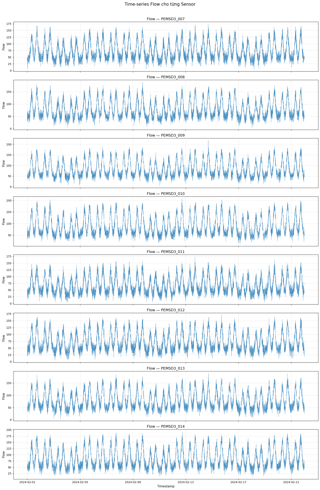

Hình 2.1 cho thấy lưu lượng thay đổi theo chu kỳ ngày, có mức thấp vào ban đêm và tăng mạnh vào các khung giờ cao điểm. Quan sát theo cảm biến cho thấy `PEMSD3_010`, `PEMSD3_009` và `PEMSD3_014` thường có lưu lượng cao hơn, phù hợp với thống kê mean và max trong Bảng 2.2.

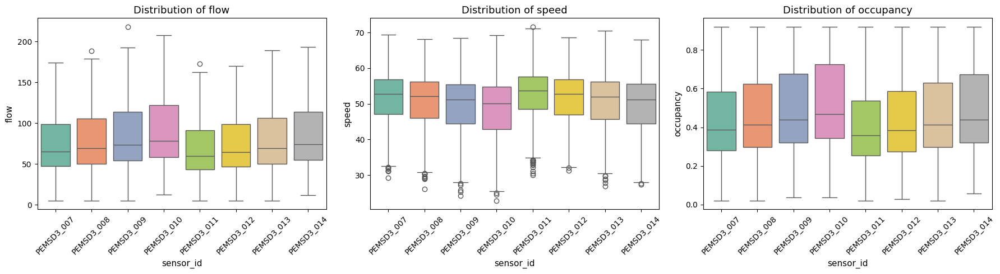

Hình 2.2 thể hiện phân phối của dữ liệu theo các biến giao thông. Các cảm biến có phân phối khác nhau nhưng cùng giữ cấu trúc chung: flow và occupancy tăng trong các pha tải cao, còn speed có xu hướng giảm khi đường đông hơn.

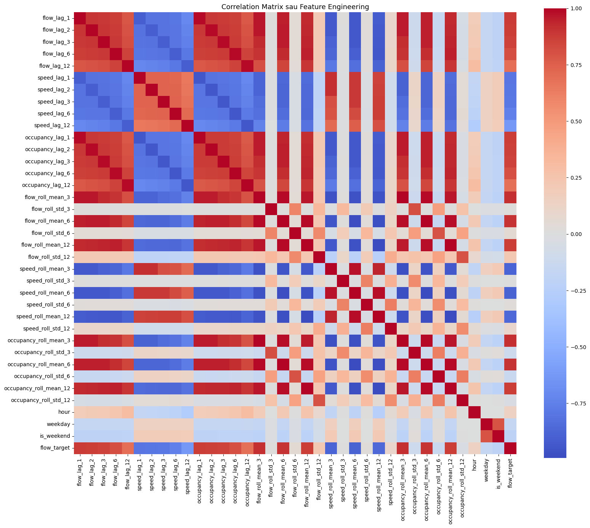

Ma trận tương quan được vẽ sau bước feature engineering, sử dụng 36 feature model-ready cùng `flow_target`. Hình 2.3 cho thấy các lag và rolling mean của `flow` có tương quan dương mạnh với target, trong khi các đặc trưng tốc độ có xu hướng tương quan âm với nhóm lưu lượng và occupancy. Kết quả này phù hợp với quy luật giao thông: khi mật độ và lưu lượng tăng, tốc độ trung bình có xu hướng giảm; đồng thời nó xác nhận rằng các đặc trưng rolling/lag được tạo ra có liên hệ trực tiếp với bài toán dự báo 15 phút.

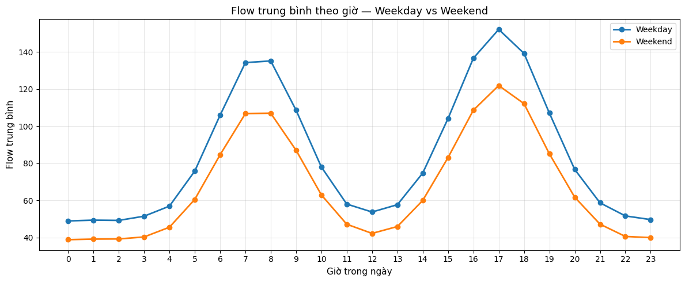

Theo thống kê theo giờ, flow trung bình thấp nhất vào khoảng 0 giờ với giá trị 46,06 và cao nhất vào khoảng 17 giờ với giá trị 143,43. Dữ liệu có hai pha cao điểm rõ: buổi sáng khoảng 7-8 giờ và buổi chiều khoảng 16-18 giờ. Điều này giải thích vì sao biến `hour` có vị trí cao trong bảng SHAP của mô hình XGBoost.

## 2.2. Xử lý dữ liệu và chia baseline

Dữ liệu được đọc bằng module `data_loader.py`, sau đó được parse `timestamp`, sắp xếp theo `sensor_id` và `timestamp`, kiểm tra missing value và kiểm tra khoảng trống thời gian. Kết quả notebook cho thấy không có missing value và không có timestamp gap ở cả 8 cảm biến, nên pipeline không cần nội suy dữ liệu thiếu.

Sau bước tạo đặc trưng, dữ liệu giảm từ 48.384 xuống 48.264 dòng vì các dòng đầu bị thiếu lag/rolling và các dòng cuối bị thiếu target tương lai. Dữ liệu sau đó được chia thành hai baseline theo sensor. Baseline A và Baseline B đều có 24.132 dòng sau feature engineering. Mỗi baseline được chia hold-out theo thời gian, không shuffle, với 16.892 dòng train, 3.620 dòng validation và 3.620 dòng test. Khoảng thời gian của tập train là 01/02/2024 01:00 đến 15/02/2024 16:50; validation là 15/02/2024 16:55 đến 18/02/2024 20:15; test là 18/02/2024 20:20 đến 21/02/2024 23:40.

## 2.3. Tạo đặc trưng

Feature engineering là phần quyết định để biến chuỗi thời gian thành dữ liệu model-ready. Toàn bộ phép shift và rolling đều được thực hiện theo nhóm `sensor_id`, tránh tình trạng lag chéo từ cảm biến này sang cảm biến khác. Đây là yêu cầu quan trọng vì mỗi cảm biến là một chuỗi thời gian riêng.

**Bảng 2.3. Nhóm đặc trưng sử dụng cho mô hình**

| Nhóm đặc trưng | Mô tả | Số lượng |
| --- | --- | --- |
| Lag features | `flow`, `speed`, `occupancy` tại các lag 1, 2, 3, 6, 12 tương ứng t-5 phút, t-10 phút, t-15 phút, t-30 phút và t-1 giờ | 15 |
| Rolling features | Mean và std của `flow`, `speed`, `occupancy` với cửa sổ 3, 6, 12 tương ứng 15 phút, 30 phút và 1 giờ | 18 |
| Time features | `hour`, `weekday`, `is_weekend` | 3 |
| Tổng feature | Các biến đưa vào X | 36 |
| Target | `flow_target = flow(t+3)` | 1 |

Các đặc trưng rolling giúp mô hình nắm được trạng thái gần đây của giao thông, ví dụ trung bình flow 15 phút hoặc 30 phút trước. Các đặc trưng lag giữ lại giá trị tại các thời điểm cụ thể trong quá khứ. Các đặc trưng thời gian phản ánh chu kỳ trong ngày và khác biệt giữa ngày thường với cuối tuần. Sau khi tạo đặc trưng, ma trận đầu vào của mỗi baseline có kích thước `X_train = (16892, 36)`, `X_valid = (3620, 36)` và `X_test = (3620, 36)`.

## 2.4. Các metrics đánh giá

Đề tài sử dụng nhiều metrics để đánh giá mô hình vì mỗi chỉ tiêu phản ánh một khía cạnh khác nhau của sai số. RMSE được chọn làm tiêu chí chính để xếp hạng mô hình vì nó phạt mạnh các lỗi lớn, phù hợp với bài toán giao thông khi các đỉnh bất thường là những trường hợp quan trọng cần dự báo tốt.

**Bảng 2.4. Các chỉ tiêu đánh giá mô hình**

| Metric | Ý nghĩa | Vai trò trong đề tài |
| --- | --- | --- |
| MAE | Sai số tuyệt đối trung bình | Dễ diễn giải theo đơn vị flow |
| RMSE | Căn bậc hai của sai số bình phương trung bình | Tiêu chí chính để chọn mô hình |
| MAPE | Sai số phần trăm tuyệt đối trung bình | Đánh giá sai số tương đối |
| R2 | Tỷ lệ phương sai được mô hình giải thích | Đánh giá mức độ phù hợp tổng quát |
| MASE | Sai số tuyệt đối đã scale theo naive baseline | So sánh với mô hình chuỗi thời gian đơn giản |

## 2.5. Kết luận chương 2

Chương 2 đã trình bày quá trình xây dựng cơ sở dữ liệu cho bài toán dự báo flow sau 15 phút. Dữ liệu gốc sạch, không có missing value và không có timestamp gap, do đó pipeline tập trung vào đặc trưng hóa chuỗi thời gian. Việc chia dữ liệu theo thứ tự thời gian giúp đảm bảo đánh giá không bị rò rỉ tương lai. Hai baseline có đặc điểm giao thông khác nhau, tạo cơ sở hợp lý để so sánh hiệu năng mô hình giữa hai cụm cảm biến.

\newpage

# CHƯƠNG 3: ƯỚC TÍNH LƯU LƯỢNG GIAO THÔNG DỰA TRÊN CÁC MÔ HÌNH HỌC MÁY

## 3.1. Xây dựng sơ đồ mô hình dự báo

Quy trình dự báo trong `main.ipynb` đi từ dữ liệu gốc đến mô hình cuối theo một pipeline end-to-end. Dữ liệu được load và EDA, sau đó tạo đặc trưng lag/rolling/time, chia thành Baseline A và Baseline B, chia train/validation/test theo thời gian, huấn luyện 10 mô hình cho mỗi baseline, so sánh kết quả, phân tích lỗi, tối ưu RandomForest và XGBoost bằng Pymoo, kiểm định ổn định bằng Monte Carlo và trượt thời gian, giải thích bằng SHAP, cuối cùng thử nghiệm GAN để sinh dữ liệu ảo.

```text
Dữ liệu PeMSD3
  -> EDA và kiểm tra chất lượng dữ liệu
  -> Feature engineering theo từng sensor
  -> Chia Baseline A/B
  -> Hold-out split theo thời gian
  -> Huấn luyện 10 mô hình mỗi baseline
  -> So sánh metrics và phân tích lỗi
  -> Tối ưu Pymoo cho RandomForest và XGBoost
  -> Monte Carlo và time sliding stability
  -> SHAP explainability
  -> GAN synthetic data và đánh giá tăng cường dữ liệu
```

Điểm quan trọng trong pipeline là notebook chỉ đóng vai trò điều phối, còn logic xử lý chính nằm trong các module như `data_loader.py`, `feature_engineering.py`, `models.py`, `comparison.py`, `error_analysis.py`, `optimization.py`, `stability.py`, `explainability.py` và `gan_synthetic.py`. Cách tổ chức này giúp báo cáo, code và kết quả có thể kiểm tra lại từng bước.

## 3.2. Huấn luyện baseline và so sánh hai cụm sensor

Mỗi baseline được huấn luyện 10 mô hình. Ba mô hình đầu là mốc naive gồm Seasonal Naive, Drift Method và Simple Moving Average. Bảy mô hình còn lại gồm Linear Regression, Ridge, KNN, Decision Tree, RandomForest, XGBoost và LSTM. Các mô hình được đánh giá trên train, validation và test, sau đó so sánh theo tập test.

**Bảng 3.1. Kết quả so sánh 10 mô hình trên hai baseline**

| Mô hình | A_MAE | B_MAE | A_RMSE | B_RMSE | A_MAPE | B_MAPE | A_R2 | B_R2 | A_MASE | B_MASE | Baseline tốt hơn |
| --- | --- | --- | --- | --- | --- | --- | --- | --- | --- | --- | --- |
| 5_RandomForest | 10,38 | 10,64 | 13,06 | 13,38 | 15,56 | 17,87 | 0,8876 | 0,8679 | 0,7581 | 0,7821 | A |
| 6_XGBoost | 10,51 | 10,62 | 13,21 | 13,37 | 15,72 | 17,81 | 0,8850 | 0,8682 | 0,7671 | 0,7806 | A |
| 7_LSTM | 10,70 | 10,93 | 13,44 | 13,73 | 15,95 | 18,04 | 0,8810 | 0,8609 | 0,7809 | 0,8035 | A |
| 3_KNN | 11,15 | 11,43 | 14,01 | 14,42 | 16,54 | 19,14 | 0,8706 | 0,8466 | 0,8141 | 0,8405 | A |
| 1_LinearRegression | 11,41 | 11,53 | 14,28 | 14,35 | 17,25 | 19,39 | 0,8657 | 0,8480 | 0,8331 | 0,8480 | A |
| 2_Ridge | 11,41 | 11,54 | 14,28 | 14,35 | 17,24 | 19,39 | 0,8656 | 0,8480 | 0,8333 | 0,8480 | A |
| 4_DecisionTree | 13,74 | 13,81 | 17,40 | 17,45 | 20,04 | 22,05 | 0,8004 | 0,7753 | 1,0029 | 1,0155 | A |
| 0b_DriftMethod | 14,73 | 14,34 | 18,48 | 18,05 | 21,33 | 23,23 | 0,7750 | 0,7598 | 1,0752 | 1,0541 | B |
| 0c_SMA | 15,51 | 14,90 | 19,07 | 18,42 | 21,13 | 22,83 | 0,7603 | 0,7499 | 1,1325 | 1,0956 | B |
| 0a_SeasonalNaive | 24,89 | 23,64 | 30,42 | 29,14 | 32,88 | 35,02 | 0,3902 | 0,3735 | 1,8171 | 1,7378 | B |

Mô hình tốt nhất của Baseline A là RandomForest với RMSE test 13,06, MAE 10,38 và R2 0,8876. Mô hình tốt nhất của Baseline B là XGBoost với RMSE test 13,37, MAE 10,62 và R2 0,8682. Khi xét toàn bộ 10 mô hình, RMSE trung bình của Baseline B thấp hơn một chút do các mô hình naive hoạt động tốt hơn trên cụm B. Tuy nhiên, nếu xét riêng nhóm học máy từ Linear Regression đến LSTM, Baseline A tốt hơn ở tất cả các mô hình. Điều này cho thấy cụm A tuy có tải giao thông cao hơn nhưng tín hiệu học máy ổn định và dễ khai thác hơn.

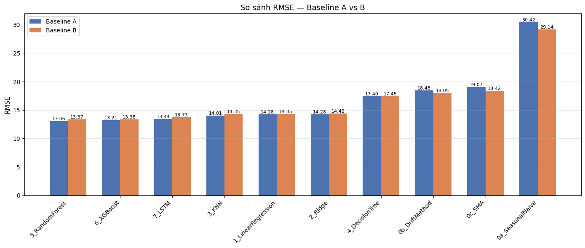

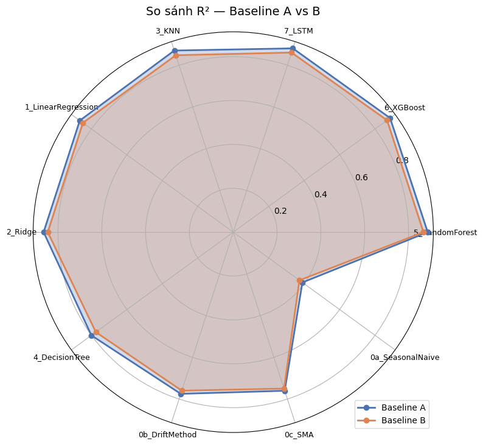

Hai hình trên cho thấy nhóm ensemble đứng đầu rõ rệt so với các mô hình naive. RandomForest và XGBoost có RMSE thấp nhất, R2 cao nhất và MASE nhỏ hơn 1, chứng minh chúng vượt qua mốc dự báo naive. DecisionTree đơn lẻ có hiện tượng overfitting mạnh hơn, thể hiện qua sai số test cao hơn so với RandomForest.

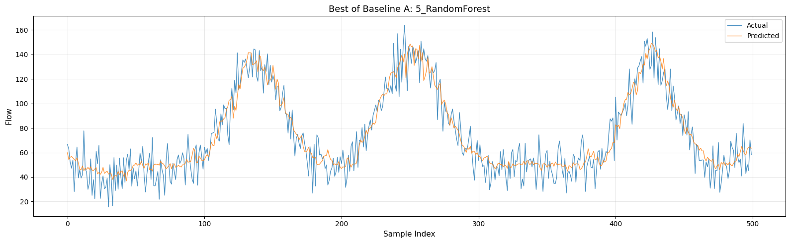

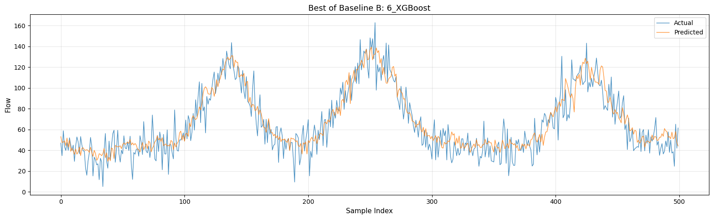

Đường dự báo của hai mô hình tốt nhất bám tương đối sát xu hướng thực tế, đặc biệt ở các pha tăng giảm theo ngày. Sai số lớn thường xuất hiện tại các điểm đỉnh hoặc các pha chuyển trạng thái nhanh, khi flow tăng hoặc giảm mạnh trong thời gian ngắn.

## 3.3. Phân tích lỗi dự báo

Phân tích lỗi được thực hiện trên mô hình tốt nhất của từng baseline: RandomForest cho Baseline A và XGBoost cho Baseline B. Các bản ghi sai số lớn nhất tập trung nhiều ở những khung giờ có biến động mạnh, ví dụ 6-8 giờ sáng, 16-18 giờ chiều và một số thời điểm tối. Trường hợp sai số lớn nhất là Baseline B với XGBoost tại cảm biến `PEMSD3_012`, thời điểm 19/02/2024 07:20, actual 158,90 nhưng predicted 106,50, sai số 52,40. Đây là tình huống under-predict ở vùng high flow.

**Bảng 3.3. Phân tích lỗi theo chế độ lưu lượng**

| Baseline | Mô hình | Flow regime | n | MAE | RMSE | MAPE | Bias mean | Actual mean | Predicted mean | Under predict |
| --- | --- | --- | --- | --- | --- | --- | --- | --- | --- | --- |
| Baseline B | 6_XGBoost | high_flow | 1.207 | 11,35 | 14,37 | 9,33 | 3,10 | 124,15 | 121,05 | 58,58% |
| Baseline A | 5_RandomForest | high_flow | 1.207 | 11,07 | 13,96 | 8,43 | 3,19 | 133,45 | 130,26 | 60,23% |
| Baseline B | 6_XGBoost | medium_flow | 1.206 | 10,98 | 13,52 | 15,76 | 4,12 | 69,81 | 65,69 | 64,59% |
| Baseline A | 5_RandomForest | medium_flow | 1.206 | 10,71 | 13,17 | 14,18 | 4,42 | 75,66 | 71,24 | 65,92% |
| Baseline B | 6_XGBoost | low_flow | 1.207 | 9,52 | 12,12 | 28,33 | -7,33 | 42,38 | 49,71 | 23,12% |
| Baseline A | 5_RandomForest | low_flow | 1.207 | 9,38 | 11,98 | 24,08 | -7,15 | 47,04 | 54,19 | 23,36% |

Bảng 3.3 cho thấy lỗi tuyệt đối thấp nhất thường nằm ở low flow, nhưng MAPE lại cao nhất ở low flow vì mẫu số actual nhỏ. Ở high flow, mô hình có xu hướng under-predict nhiều hơn 58%, tức thường dự báo thấp hơn thực tế trong các pha tải cao. Đây là điểm quan trọng đối với ứng dụng giao thông vì under-predict tại giờ cao điểm có thể làm hệ thống cảnh báo phản ứng chậm. Nguyên nhân có thể đến từ việc dữ liệu chỉ có 21 ngày, chưa có biến sự kiện hoặc thông tin không gian giữa các cảm biến, nên các đột biến cục bộ khó dự báo.

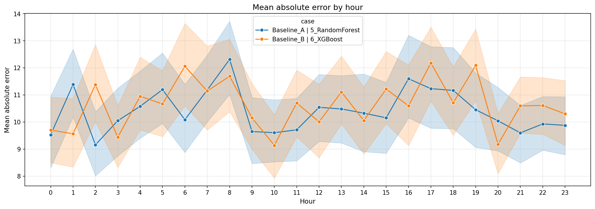

## 3.4. Tối ưu đa mục tiêu bằng Pymoo

Sau khi so sánh baseline, RandomForest và XGBoost được chọn để tối ưu vì có RMSE trung bình tốt nhất trên cả hai cụm cảm biến. Pymoo được cấu hình với NSGA-II, quần thể 300 và 100 thế hệ. Mục tiêu tối ưu gồm RMSE validation, thời gian huấn luyện và độ phức tạp mô hình.

Kết quả Pareto cho thấy XGBoost có lợi thế rõ về thời gian và độ phức tạp. Trên Baseline A, XGBoost đạt RMSE Pareto thấp nhất 12,6890 với thời gian mỗi nghiệm khoảng 0,36 đến 1,21 giây. Trên Baseline B, XGBoost đạt RMSE Pareto thấp nhất 12,5490 với thời gian khoảng 0,39 đến 1,70 giây. RandomForest cũng đạt RMSE tốt nhưng cần nhiều cây và độ sâu lớn hơn, khiến thời gian và complexity cao hơn.

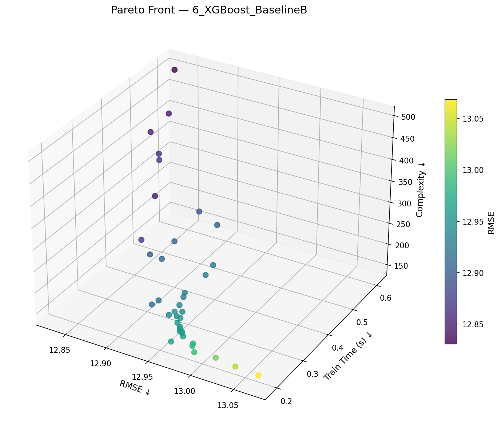

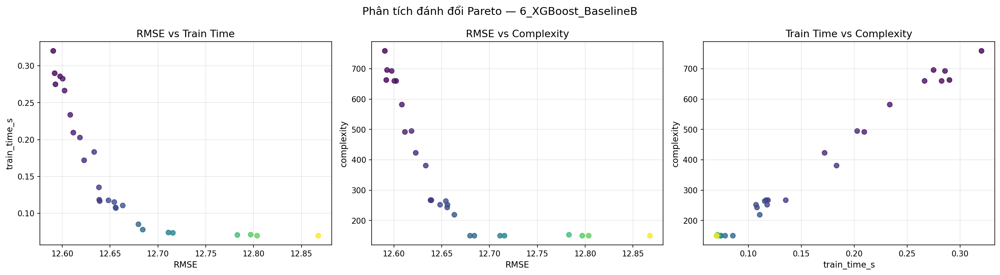

Nghiệm cân bằng cuối cùng không đơn giản là nghiệm có RMSE nhỏ nhất. Notebook tính nghiệm cân bằng bằng cách chuẩn hóa ba mục tiêu và chọn điểm gần nghiệm lý tưởng nhất. Với mô hình cuối được chọn là Baseline B - XGBoost, bộ tham số cân bằng gồm `n_estimators=64`, `max_depth=3`, `learning_rate=0.260832`, `subsample=0.960676`, `colsample_bytree=0.711963`, `reg_alpha=5.62635` và `reg_lambda=7.42661`.

## 3.5. Kiểm định độ ổn định

Sau tối ưu Pymoo, 4 trường hợp được kiểm định gồm Baseline A - RandomForest, Baseline A - XGBoost, Baseline B - RandomForest và Baseline B - XGBoost. Monte Carlo được chạy 100 lần, giữ nguyên split thời gian và chỉ thay đổi random state của thuật toán. Cách làm này kiểm tra độ nhạy của quá trình huấn luyện, không làm rò rỉ dữ liệu tương lai.

Time sliding validation được thực hiện với 5 fold. Mỗi fold dùng train 60%, test 10% và dịch cửa sổ 5%. Tập test luôn nằm sau tập train theo thời gian. Nếu hệ số biến thiên RMSE nhỏ hơn ngưỡng 10%, mô hình được xem là ổn định theo thời gian.

**Bảng 3.2. Kết quả tối ưu và kiểm định ổn định của 4 mô hình sau Pymoo**

| Xếp hạng | Trường hợp | Final score | MC RMSE mean | MC CV | Sliding RMSE mean | Sliding CV | Pareto valid RMSE | Time | Complexity | Stable |
| --- | --- | --- | --- | --- | --- | --- | --- | --- | --- | --- |
| 1 | Baseline B - 6_XGBoost | 0,2759 | 13,1694 | 0,2196% | 12,8111 | 0,6624% | 12,6259 | 0,5768 | 192 | True |
| 2 | Baseline A - 6_XGBoost | 0,3913 | 12,9443 | 0,2464% | 12,9610 | 2,5155% | 12,7776 | 0,5202 | 192 | True |
| 3 | Baseline A - 5_RandomForest | 0,6345 | 13,1696 | 0,1121% | 13,3458 | 1,6412% | 13,3405 | 10,5447 | 350 | True |
| 4 | Baseline B - 5_RandomForest | 0,6419 | 13,3803 | 0,1084% | 13,2321 | 0,8465% | 13,1984 | 12,3485 | 350 | True |

Bảng 3.2 cho thấy cả 4 mô hình đều ổn định theo ngưỡng CV. Baseline A - XGBoost có MC RMSE thấp nhất, nhưng Baseline B - XGBoost đạt điểm tổng hợp tốt nhất nhờ RMSE trượt thời gian thấp nhất, CV trượt thời gian thấp nhất và chi phí mô hình thấp. Với mô hình cuối, RMSE Monte Carlo dao động trong khoảng 13,1014 đến 13,2419 và khoảng tin cậy 95% là 13,1638 đến 13,1751, cho thấy sai số rất ít nhạy với random state.

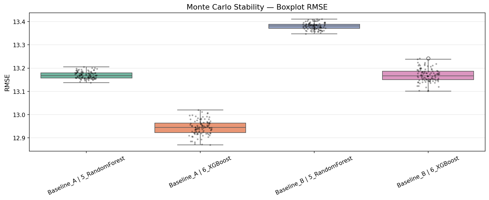

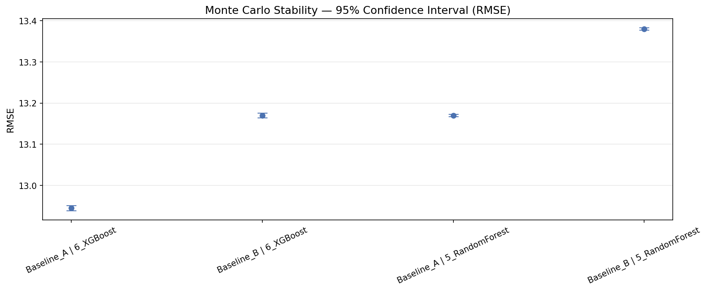

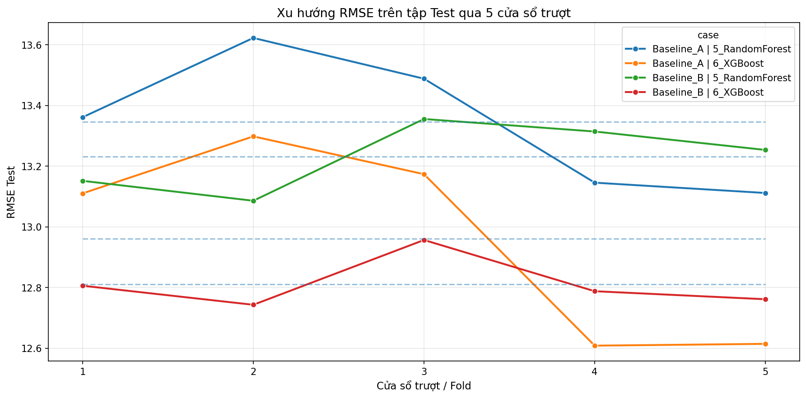

Ở time sliding, Baseline B - XGBoost có RMSE lần lượt là 12,8061; 12,7433; 12,9567; 12,7880 và 12,7616 qua 5 fold. Độ dao động nhỏ, không có fold tăng đột biến, và CV chỉ 0,6624%. Điều này củng cố kết luận rằng mô hình được chọn có khả năng hoạt động ổn định trên các giai đoạn thời gian khác nhau của dữ liệu.

## 3.6. Tăng cường dữ liệu bằng GAN

GAN được huấn luyện riêng cho từng baseline trong không gian feature-space gồm 36 đặc trưng và `flow_target`. Mỗi baseline sử dụng mẫu huấn luyện 8.000 dòng để train GAN, sau đó sinh dữ liệu ảo đủ cho tỷ lệ tối đa 2,0x. Với mỗi mô hình tối ưu, đề tài thử 4 kịch bản: chỉ dùng dữ liệu thật, dữ liệu thật cộng 50% synthetic, dữ liệu thật cộng 100% synthetic và dữ liệu thật cộng 200% synthetic.

Kết quả đánh giá chéo cho thấy dữ liệu GAN học được một phần quy luật của dữ liệu thật. Trung bình kịch bản Train Real/Test Fake có RMSE khoảng 15,40 đến 15,48 và R2 khoảng 0,844 đến 0,846. Kịch bản Train Fake/Test Real có RMSE khoảng 16,28 đến 16,35 và R2 khoảng 0,800 đến 0,802. Như vậy dữ liệu ảo có utility nhất định, nhưng vẫn còn khoảng cách so với dữ liệu thật.

**Bảng 3.4. Kết quả tăng cường dữ liệu bằng GAN theo RMSE**

| Trường hợp | Real only | +50% synthetic | +100% synthetic | +200% synthetic |
| --- | --- | --- | --- | --- |
| Baseline A - 5_RandomForest | 13,2282 | 13,6941 | 13,9715 | 14,4046 |
| Baseline A - 6_XGBoost | 12,9420 | 13,6541 | 14,1595 | 14,7934 |
| Baseline B - 5_RandomForest | 13,4218 | 13,7485 | 13,9357 | 14,1902 |
| Baseline B - 6_XGBoost | 13,1863 | 13,7717 | 14,0437 | 14,3805 |

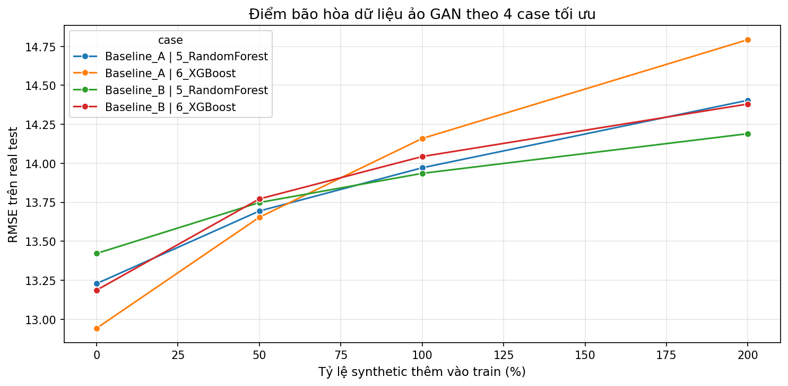

Trong cả 4 trường hợp, cấu hình chỉ dùng dữ liệu thật vẫn đạt RMSE thấp nhất. Khi thêm synthetic data, RMSE tăng dần theo tỷ lệ 0,5x, 1,0x và 2,0x. Điều này cho thấy feature-space GAN hiện tại có thể sinh dữ liệu giống một phần phân phối thật, nhưng chưa đủ chất lượng để cải thiện mô hình trên test thật. Dữ liệu ảo vẫn có giá trị phân tích vì giúp đánh giá khả năng tổng quát, nhưng không nên dùng để thay thế hoặc tăng cường trực tiếp trong cấu hình hiện tại.

## 3.7. Phân tích ảnh hưởng của các biến bằng SHAP

SHAP được tính cho 4 mô hình tối ưu gốc và mô hình sau bước GAN. Vì kịch bản GAN tốt nhất theo RMSE đều là tỷ lệ 0,0, phần SHAP sau GAN chủ yếu phản ánh mô hình tốt nhất khi pipeline có xét đến kịch bản synthetic nhưng không thêm dữ liệu ảo vào train. Kết quả quan trọng nhất nằm ở mô hình cuối Baseline B - XGBoost.

**Bảng 3.5. Top đặc trưng SHAP của mô hình cuối Baseline B - XGBoost**

| Rank | Feature | Mean absolute SHAP |
| --- | --- | --- |
| 1 | `flow_roll_mean_3` | 13,5754 |
| 2 | `occupancy_roll_mean_3` | 7,2055 |
| 3 | `flow_roll_mean_6` | 5,0360 |
| 4 | `hour` | 4,9668 |
| 5 | `other` | 3,5755 |
| 6 | `flow_lag_3` | 2,4360 |
| 7 | `occupancy_roll_mean_6` | 1,8535 |
| 8 | `speed_roll_mean_3` | 0,8940 |
| 9 | `weekday` | 0,7850 |
| 10 | `flow_roll_mean_12` | 0,7805 |

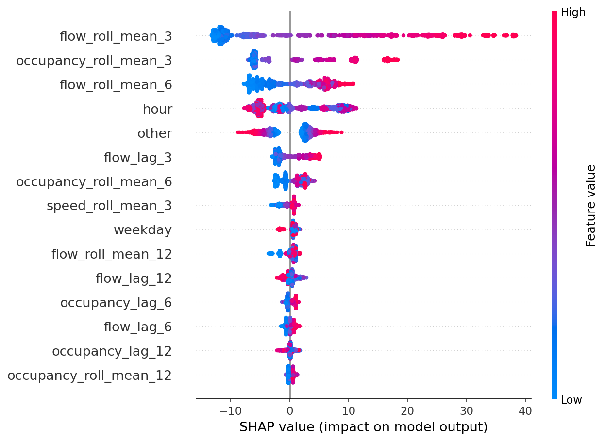

Bảng 3.5 cho thấy `flow_roll_mean_3` là đặc trưng có ảnh hưởng mạnh nhất, tức trung bình lưu lượng trong 15 phút gần nhất là tín hiệu chính để dự báo 15 phút tiếp theo. `occupancy_roll_mean_3` đứng thứ hai, chứng minh trạng thái chiếm dụng detector là chỉ báo quan trọng của mật độ giao thông. Biến `hour` đứng trong top 4, phù hợp với EDA về hai pha cao điểm sáng và chiều. Các đặc trưng trễ như `flow_lag_3` và thống kê cuộn dài hơn như `flow_roll_mean_6`, `flow_roll_mean_12` giúp mô hình phân biệt xu hướng ngắn hạn với nền giao thông ổn định hơn.

Khi so sánh RandomForest và XGBoost, nhóm đặc trưng quan trọng giữ cấu trúc khá nhất quán: rolling mean của flow luôn đứng đầu, sau đó là occupancy rolling và hour. Điều này chứng minh feature engineering đã tạo đúng nhóm tín hiệu có ý nghĩa vật lý. Mô hình không chỉ học từ một giá trị flow tức thời mà sử dụng bối cảnh gần nhất của cả lưu lượng, độ chiếm dụng và chu kỳ trong ngày.

## 3.8. Nhận xét và kết luận chương 3

Chương 3 cho thấy mô hình học máy, đặc biệt là RandomForest và XGBoost, vượt trội rõ rệt so với các phương pháp naive. Baseline A có kết quả tốt hơn ở hầu hết mô hình học máy, nhưng sau khi tối ưu và kiểm định ổn định, Baseline B - XGBoost được chọn là mô hình cuối vì đạt điểm tổng hợp tốt nhất. Mô hình này có RMSE hold-out 13,3665, RMSE Monte Carlo trung bình 13,1694, RMSE time sliding trung bình 12,8111 và đạt ổn định ở cả hai phép kiểm định.

Phần GAN cho thấy sinh dữ liệu ảo là hướng mở rộng có giá trị nhưng chưa cải thiện trực tiếp sai số trong cấu hình hiện tại. Kết quả SHAP khẳng định vai trò trung tâm của các đặc trưng rolling ngắn hạn, occupancy và hour. Đây là kết luận có ý nghĩa thực tiễn vì hệ thống vận hành giao thông cần ưu tiên giám sát biến động ngắn hạn thay vì chỉ nhìn giá trị tức thời.

\newpage

# KẾT LUẬN VÀ KIẾN NGHỊ

## 1. Kết luận

Đề tài đã xây dựng được pipeline end-to-end cho bài toán dự báo lưu lượng giao thông trên dữ liệu PeMSD3. Dữ liệu được xử lý đúng đặc thù chuỗi thời gian, đặc trưng được tạo theo từng sensor, dữ liệu được chia train/validation/test theo thời gian và không shuffle. Hai cụm cảm biến được so sánh độc lập, mỗi cụm có 10 mô hình dự báo, bảo đảm đáp ứng yêu cầu so sánh ít nhất hai baseline và nhiều mô hình học máy.

Kết quả thực nghiệm cho thấy RandomForest là mô hình tốt nhất trên Baseline A với RMSE 13,06, còn XGBoost là mô hình tốt nhất trên Baseline B với RMSE 13,37. Sau tối ưu đa mục tiêu bằng Pymoo và kiểm định ổn định, Baseline B - XGBoost được chọn làm mô hình cuối vì đạt final score thấp nhất, RMSE trượt thời gian tốt nhất và chi phí mô hình thấp. Kiểm định Monte Carlo và time sliding đều cho thấy mô hình ổn định, với CV rất nhỏ so với ngưỡng 10%.

Phân tích lỗi chỉ ra rằng các sai số lớn tập trung ở pha high flow hoặc lúc chuyển trạng thái nhanh, đặc biệt tại giờ cao điểm. SHAP cho thấy các đặc trưng quan trọng nhất là `flow_roll_mean_3`, `occupancy_roll_mean_3`, `flow_roll_mean_6` và `hour`, phù hợp với quy luật giao thông thực tế. Phần GAN đã sinh được dữ liệu ảo và kiểm tra được Real/Fake utility, nhưng kết quả tăng cường dữ liệu cho thấy synthetic data chưa cải thiện RMSE trên test thật trong cấu hình hiện tại.

## 2. Kiến nghị

Hướng phát triển đầu tiên là mở rộng dữ liệu theo thời gian và không gian. Bộ dữ liệu hiện chỉ có 21 ngày và 8 cảm biến trong cùng district, nên mô hình có thể chưa học đủ các biến động dài hạn như ngày lễ, sự kiện, thời tiết hoặc thay đổi hạ tầng. Nếu có dữ liệu nhiều tháng và nhiều cụm sensor hơn, có thể đánh giá tốt hơn khả năng tổng quát hóa.

Hướng phát triển thứ hai là bổ sung mô hình chuyên sâu cho chuỗi thời gian và không gian. LSTM hiện tại hoạt động trên dữ liệu đã feature engineering dạng bảng, chưa tận dụng đầy đủ sequence nhiều bước. Có thể thử TimeSeries Transformer, Temporal Fusion Transformer, TCN hoặc mô hình graph neural network nếu có quan hệ không gian giữa các cảm biến.

Hướng phát triển thứ ba là cải tiến phần sinh dữ liệu. Feature-space GAN chưa cải thiện kết quả test thật, do đó nên thử TimeGAN, Conditional GAN hoặc các mô hình sinh dữ liệu có ràng buộc thời gian. Ngoài ra, thay vì sinh dữ liệu cho toàn bộ phân phối, có thể sinh có chủ đích cho các pha high flow hoặc các trường hợp hiếm, nơi mô hình hiện còn under-predict.

Hướng phát triển cuối cùng là triển khai mô hình trong dashboard vận hành. Dự án đã có thư mục `dashboard/` và registry mô hình trong `__datasets-clean/demo_model_registry.csv`. Có thể tiếp tục hoàn thiện dashboard để người dùng chọn sensor, xem dự báo, xem cảnh báo và theo dõi các đặc trưng SHAP quan trọng theo thời gian thực.

\newpage

# TÀI LIỆU THAM KHẢO

[1] California Department of Transportation, Performance Measurement System (PeMS), bộ dữ liệu giao thông cảm biến.

[2] F. Pedregosa và cộng sự, "Scikit-learn: Machine Learning in Python", Journal of Machine Learning Research, 2011.

[3] T. Chen và C. Guestrin, "XGBoost: A Scalable Tree Boosting System", Proceedings of the 22nd ACM SIGKDD, 2016.

[4] K. Deb, A. Pratap, S. Agarwal và T. Meyarivan, "A Fast and Elitist Multiobjective Genetic Algorithm: NSGA-II", IEEE Transactions on Evolutionary Computation, 2002.

[5] S. Lundberg và S. Lee, "A Unified Approach to Interpreting Model Predictions", NeurIPS, 2017.

[6] I. Goodfellow và cộng sự, "Generative Adversarial Nets", NeurIPS, 2014.

[7] Tài liệu dự án: `main.ipynb`, `.docs/plan.md`, `.docs/workflow.md`, `.docs/structure.md`, `configs/configs.py` và các kết quả trong `resultImages/`.
